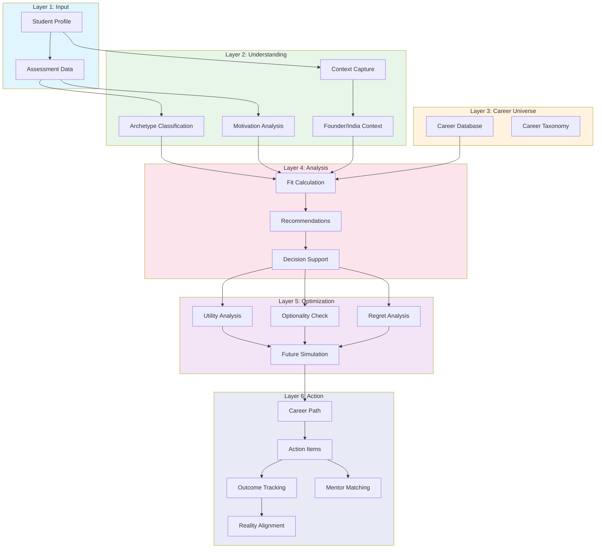

# 01 - System Overview

## Purpose

This document provides a comprehensive overview of the CareerOS Intelligence Architecture, serving as the entry point for understanding how all intelligence modules work together to guide students toward optimal career decisions.

## Problem Solved

Career decisions are among the most consequential choices students make, yet:
- Students lack comprehensive self-understanding
- Career information is fragmented and outdated
- Decision-making is often based on limited factors
- No systematic way to evaluate trade-offs
- Outcomes are rarely tracked to improve recommendations

CareerOS Intelligence solves this by creating a multi-layered intelligence system that captures the complete picture and computes optimal paths.

---

## Architecture Layers

### Layer 1: Input Layer
**Purpose**: Capture student data and assessment signals

| Module | Responsibility |
|--------|---------------|
| Student Intelligence | Manage student profiles, preferences, and history |
| Assessment Intelligence | Administer assessments and extract signals |

**Key Output**: Normalized student signals ready for analysis

---

### Layer 2: Understanding Layer
**Purpose**: Build deep understanding of the student

| Module | Responsibility |
|--------|---------------|
| Archetype Intelligence | Classify students into archetypes |
| Motivation Intelligence | Understand what drives the student |
| Context Intelligence | Capture situational context |
| Founder Intelligence | Support founder journey decisions |
| India Intelligence | Apply India-specific context |

**Key Output**: Multi-dimensional student understanding

---

### Layer 3: Career Layer
**Purpose**: Manage career universe and taxonomy

| Module | Responsibility |
|--------|---------------|
| Career Intelligence | Career data, requirements, trajectories |
| Career Taxonomy | Classification and relationships |

**Key Output**: Structured career universe with relationships

---

### Layer 4: Analysis Layer
**Purpose**: Compute fits and generate recommendations

| Module | Responsibility |
|--------|---------------|
| Career Fit Engine | Calculate student-career fit scores |
| Recommendation Engine | Generate ranked recommendations |
| Decision Intelligence | Support decision-making |

**Key Output**: Ranked, explainable recommendations

---

### Layer 5: Optimization Layer
**Purpose**: Optimize for long-term outcomes

| Module | Responsibility |
|--------|---------------|
| Utility Intelligence | Calculate expected utility |
| Optionality Intelligence | Preserve future options |
| Regret Intelligence | Minimize future regret |
| Future Simulation | Simulate career scenarios |

**Key Output**: Optimized career strategy

---

### Layer 6: Action Layer
**Purpose**: Translate insights into action

| Module | Responsibility |
|--------|---------------|
| Career Path Intelligence | Plan career paths |
| Action Intelligence | Recommend specific actions |
| Outcome Tracking | Monitor actual outcomes |
| Career Reality | Align expectations with reality |
| Mentor Intelligence | Match with mentors |

**Key Output**: Actionable career roadmap

---

## System Flow



---

## Key Design Decisions

### 1. Modular Architecture
- Each intelligence module has clear responsibilities
- Modules communicate through well-defined interfaces
- Enables independent development and testing

### 2. Signal-Based Processing
- All student data is converted to normalized signals
- Signals flow through the system with metadata
- Enables traceability and explainability

### 3. Context Preservation
- Student context is maintained throughout the pipeline
- India-specific and founder-specific contexts are first-class
- Prevents loss of important situational factors

### 4. Feedback Loops
- Outcomes feed back into model improvements
- Continuous learning from real-world results
- Model drift detection and correction

---

## Data Model Overview

### Core Entities

```
Student
├── Profile (demographics, education, etc.)
├── Assessments (completed assessments)
├── Signals (extracted insights)
├── Archetype (classification)
├── Motivations (drivers)
└── Context (situational factors)

Career
├── Metadata (title, category, etc.)
├── Requirements (skills, education, etc.)
├── Trajectory (typical paths)
├── Market Data (demand, salary, etc.)
└── Relationships (related careers)

Recommendation
├── Career (target career)
├── Fit Score (0-100)
├── Rationale (explanation)
├── Confidence (certainty)
└── Actions (next steps)
```

---

## Integration Points

### External Systems
| System | Integration | Data Flow |
|--------|-------------|-----------|
| Assessment Providers | API | Assessment data in |
| Career Data Sources | API/Scrape | Career info in |
| University Systems | API | Student data sync |
| Job Market APIs | API | Market data in |
| Mentor Platforms | API | Mentor matching |

### Internal Services
| Service | Purpose |
|---------|---------|
| Authentication | User identity |
| Notification | Alerts and updates |
| Analytics | Usage tracking |
| ML Platform | Model training |

---

## Scalability Considerations

### Horizontal Scaling
- Intelligence modules are stateless
- Can scale compute-heavy modules independently
- Message queue for async processing

### Data Scaling
- Sharding by student ID
- Read replicas for career data
- Cache layer for hot data

### Model Scaling
- Feature flags for model versions
- A/B testing framework
- Gradual rollout capability

---

## Security & Privacy

### Data Classification
| Level | Data | Handling |
|-------|------|----------|
| Public | Career info, taxonomy | Open access |
| Internal | Aggregated analytics | Internal use |
| Confidential | Student profiles | Encrypted, access controlled |
| Restricted | Assessment responses | Highest security |

### Privacy Controls
- Data minimization
- Purpose limitation
- Retention policies
- Right to deletion
- Consent management

---

## Monitoring & Observability

### Key Metrics
| Category | Metrics |
|----------|---------|
| System Health | Latency, throughput, errors |
| Model Performance | Accuracy, drift, confidence |
| Business | Recommendations, actions, outcomes |
| User | Engagement, satisfaction, retention |

### Alerting
- Model performance degradation
- Data quality issues
- System errors
- Anomalous patterns

---

## Current Status

| Aspect | Status |
|--------|--------|
| Architecture Design | ✅ Complete |
| Documentation | ✅ Complete |
| Core Data Models | 🚧 In Progress |
| Input Layer | 🚧 In Progress |
| Understanding Layer | 📋 Planned |
| Career Layer | 🚧 In Progress |
| Analysis Layer | 📋 Planned |
| Optimization Layer | 📋 Planned |
| Action Layer | 📋 Planned |

---

## Next Steps

1. Complete core data model implementation
2. Build Student Intelligence module
3. Build Assessment Intelligence module
4. Implement Archetype classification
5. Create Career Taxonomy

---

## References

- [02-student-intelligence.md](./02-student-intelligence.md)
- [03-assessment-intelligence.md](./03-assessment-intelligence.md)
- [23-data-flow-map.md](./23-data-flow-map.md)
- [24-dependency-map.md](./24-dependency-map.md)

---

*Last Updated: 2026-06-02*
