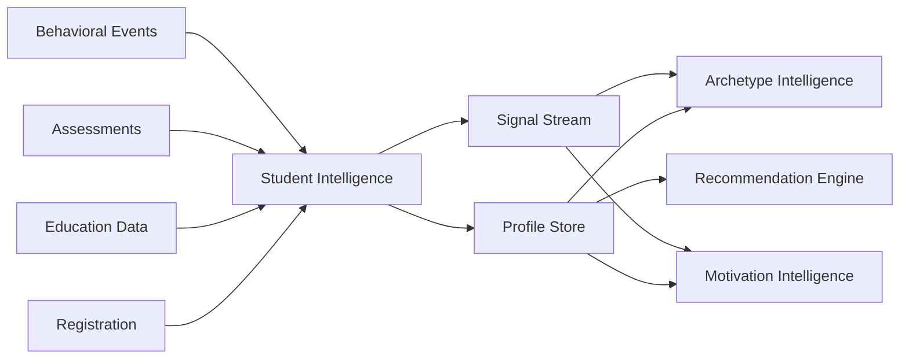

# 02 - Student Intelligence

## Purpose

Student Intelligence serves as the foundational identity and profile management system for CareerOS. It captures, maintains, and enriches the complete student profile—demographics, education, preferences, history, and behavioral signals—to power all downstream intelligence modules.

## Problem Solved

- Students have fragmented identity across systems
- No unified view of student capabilities and preferences
- Historical career exploration data is lost
- Difficult to track student evolution over time
- No systematic way to capture implicit signals (behavior, engagement)

## Inputs

| Input | Source | Format | Frequency |
|-------|--------|--------|-----------|
| Basic Profile | Registration | Form data | Once |
| Education History | Student input / SIS sync | Structured data | On change |
| Preferences | Preference settings | Key-value pairs | Continuous |
| Behavioral Signals | User interactions | Event stream | Real-time |
| Assessment History | Assessment Intelligence | Results object | Per assessment |
| Career Interactions | Career exploration | Activity log | Real-time |
| Outcome Data | Outcome Tracking | Results | Periodic |

## Outputs

| Output | Description | Consumers |
|--------|-------------|-----------|
| Student Profile | Complete enriched profile | All modules |
| Student Signals | Normalized behavioral signals | Archetype, Motivation Intelligence |
| Preference Vector | Structured preferences | Recommendation Engine |
| History Timeline | Chronological student journey | Decision Intelligence |
| Segment Tags | Classification tags | Analytics, Targeting |

## Dependencies

| Dependency | Purpose |
|------------|---------|
| Authentication Service | Identity verification |
| Assessment Intelligence | Assessment results |
| Database (Student Store) | Persistent storage |
| Event Bus | Real-time signal streaming |

## Consumers

| Consumer | Usage |
|----------|-------|
| Archetype Intelligence | Profile analysis for archetype classification |
| Motivation Intelligence | Preference analysis for motivation mapping |
| Context Intelligence | Situational context building |
| Recommendation Engine | Personalization input |
| Decision Intelligence | Historical context for decisions |
| Analytics | Cohort analysis, segmentation |

## Data Flow



## Key Interfaces

### Student Profile API
```typescript
interface StudentProfile {
  id: string;
  demographics: Demographics;
  education: EducationHistory[];
  preferences: Preferences;
  assessments: AssessmentRef[];
  archetype?: Archetype;
  signals: Signal[];
  createdAt: Date;
  updatedAt: Date;
}

interface StudentIntelligenceService {
  createProfile(profile: CreateProfileInput): Promise<StudentProfile>;
  getProfile(id: string): Promise<StudentProfile>;
  updateProfile(id: string, updates: ProfileUpdates): Promise<StudentProfile>;
  recordSignal(id: string, signal: Signal): Promise<void>;
  getSignals(id: string, type?: SignalType): Promise<Signal[]>;
  getHistory(id: string): Promise<HistoryEvent[]>;
}
```

## Key Engines

| Engine | Purpose | Status |
|--------|---------|--------|
| Profile Manager | CRUD operations for profiles | 🚧 In Progress |
| Signal Processor | Behavioral signal extraction | 🚧 In Progress |
| Preference Analyzer | Preference inference from behavior | 📋 Planned |
| Change Detector | Profile drift detection | 📋 Planned |

## Current Status

| Component | Status | Notes |
|-----------|--------|-------|
| Data Model | ✅ Complete | Schema defined, migrations ready |
| Profile API | 🚧 In Progress | Basic CRUD implemented |
| Signal Processing | 🚧 In Progress | Event capture working |
| Preference Inference | 📋 Planned | Q3 2026 |
| History Tracking | 🚧 In Progress | Timeline storage ready |

## Future Improvements

1. **ML-Based Profile Enrichment**: Infer missing profile attributes from available data
2. **Cross-Student Similarity**: Find similar students for peer insights
3. **Predictive Modeling**: Predict likely career interests from early signals
4. **Privacy Controls**: Granular privacy settings per attribute
5. **Data Portability**: Export/import student data

## Audit Findings

| Date | Finding | Severity | Status |
|------|---------|----------|--------|
| 2026-06-02 | Signal storage needs encryption | Medium | Open |
| 2026-06-02 | Missing audit log for profile changes | Low | Open |

## Risks

| Risk | Impact | Likelihood | Mitigation |
|------|--------|------------|------------|
| Data inconsistency | High | Medium | Transaction wrapping, eventual consistency |
| Privacy breach | Critical | Low | Encryption, access controls, audit logs |
| Performance degradation | Medium | Medium | Caching, read replicas, sharding |
| Signal loss | Medium | Medium | Event persistence, retry logic |
