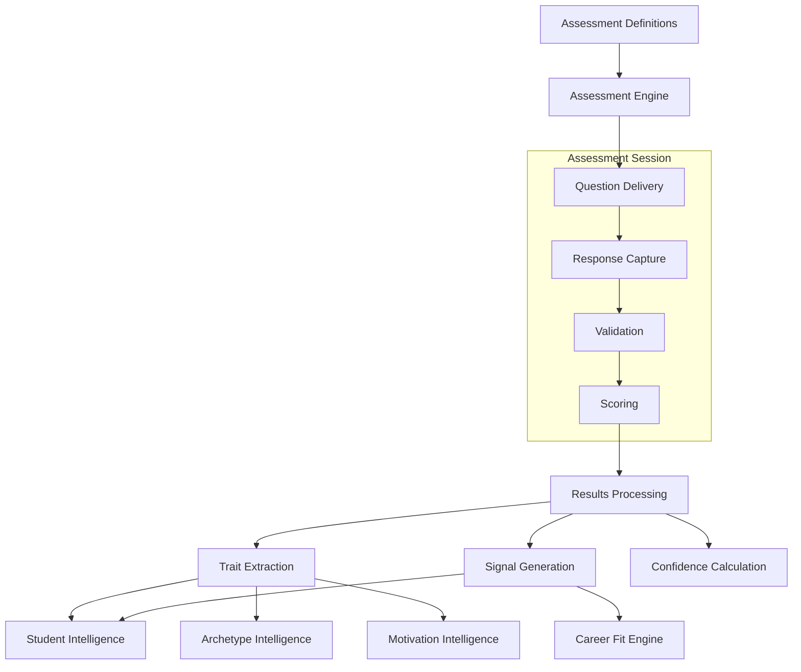

# 03 - Assessment Intelligence

## Purpose

Assessment Intelligence administers psychometric and skills assessments, processes responses, and extracts meaningful signals about student capabilities, preferences, and tendencies. It serves as the primary signal input for understanding who the student is and what drives them.

## Problem Solved

- No systematic way to capture student capabilities
- Assessments are disconnected from career guidance
- Raw scores lack interpretation context
- No adaptive assessment based on student responses
- Difficult to validate assessment quality over time

## Inputs

| Input | Source | Format | Frequency |
|-------|--------|--------|-----------|
| Assessment Definitions | Content Management | JSON/Database | On content update |
| Student Responses | Assessment UI | Response objects | Per question |
| Time Data | Assessment UI | Timing metadata | Per question |
| Session Context | Assessment UI | Session state | Per assessment |
| Validation Rules | Assessment Config | Rule definitions | On config change |

## Outputs

| Output | Description | Consumers |
|--------|-------------|-----------|
| Assessment Results | Raw and normalized scores | Student Intelligence, Archetype Intelligence |
| Trait Scores | Psychometric trait measurements | Motivation Intelligence |
| Skill Signals | Capability indicators | Career Fit Engine |
| Response Patterns | Behavioral patterns | Archetype Intelligence |
| Confidence Scores | Reliability metrics | Decision Intelligence |
| Completion Status | Progress tracking | Student Intelligence |

## Dependencies

| Dependency | Purpose |
|------------|---------|
| Student Intelligence | Student profile context |
| Assessment Content Store | Question banks, scoring keys |
| Session Store | In-progress assessment state |
| Analytics | Assessment performance tracking |

## Consumers

| Consumer | Usage |
|----------|-------|
| Student Intelligence | Store assessment results |
| Archetype Intelligence | Classify based on assessment patterns |
| Motivation Intelligence | Map traits to motivation drivers |
| Career Fit Engine | Use skill signals for fit calculation |
| Decision Intelligence | Confidence in recommendations |

## Data Flow



## Key Interfaces

### Assessment API
```typescript
interface Assessment {
  id: string;
  type: AssessmentType;
  questions: Question[];
  scoringRules: ScoringRule[];
  validityChecks: ValidityCheck[];
  estimatedDuration: number;
}

interface AssessmentResult {
  assessmentId: string;
  studentId: string;
  scores: Score[];
  traits: TraitScore[];
  signals: Signal[];
  confidence: number;
  completionTime: number;
  validityFlags: ValidityFlag[];
}

interface AssessmentIntelligenceService {
  startAssessment(studentId: string, type: AssessmentType): Promise<AssessmentSession>;
  submitResponse(sessionId: string, response: Response): Promise<QuestionResult>;
  completeAssessment(sessionId: string): Promise<AssessmentResult>;
  getResults(studentId: string, type?: AssessmentType): Promise<AssessmentResult[]>;
  validateResult(result: AssessmentResult): Promise<ValidationResult>;
}
```

## Key Engines

| Engine | Purpose | Status |
|--------|---------|--------|
| Assessment Delivery | Question presentation logic | 🚧 In Progress |
| Response Processor | Validation and normalization | 🚧 In Progress |
| Scoring Engine | Calculate raw and scaled scores | 🚧 In Progress |
| Signal Extractor | Convert responses to intelligence signals | 📋 Planned |
| Adaptive Logic | Adjust difficulty based on responses | 📋 Future |
| Quality Monitor | Track assessment reliability | 📋 Planned |

## Current Status

| Component | Status | Notes |
|-----------|--------|-------|
| Assessment Schema | ✅ Complete | Core data model defined |
| Basic Scoring | 🚧 In Progress | Simple scoring implemented |
| Trait Extraction | 📋 Planned | Requires research |
| Signal Generation | 📋 Planned | Q3 2026 |
| Adaptive Assessments | 📋 Future | Post-MVP feature |
| Quality Monitoring | 📋 Planned | Ongoing validation |

## Future Improvements

1. **Adaptive Assessment**: Adjust question difficulty in real-time
2. **Multi-Modal Input**: Support video, audio, file upload responses
3. **Gamification**: Increase engagement through game elements
4. **Cross-Assessment Validation**: Ensure consistency across different assessments
5. **Cultural Adaptation**: India-specific assessment variants

## Audit Findings

| Date | Finding | Severity | Status |
|------|---------|----------|--------|
| 2026-06-02 | Need reliability metrics for assessments | Medium | Open |
| 2026-06-02 | No standardized score interpretation | Medium | Open |

## Risks

| Risk | Impact | Likelihood | Mitigation |
|------|--------|------------|------------|
| Assessment fatigue | Medium | High | Bite-sized assessments, progress tracking |
| Invalid responses | Medium | Medium | Attention checks, validity flags |
| Cultural bias | High | Medium | Localized content, validation studies |
| Cheating/straight-lining | Medium | Medium | Randomization, consistency checks |
