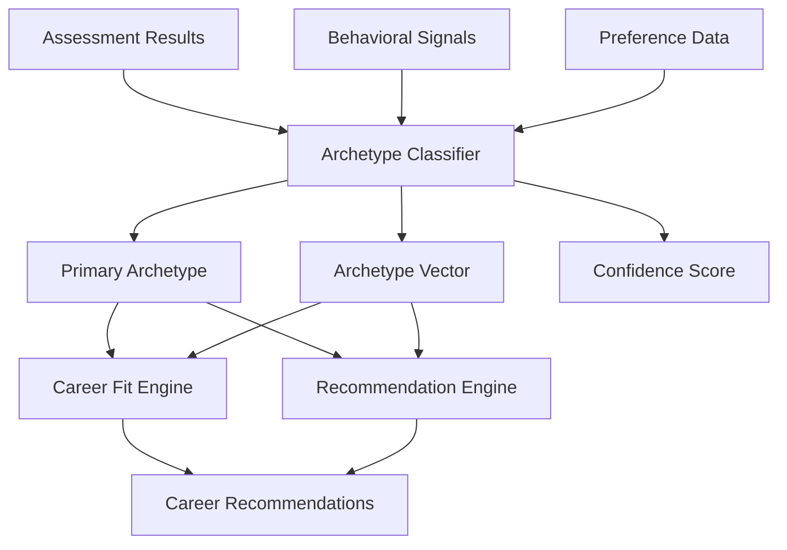

# 04 - Archetype Intelligence

## Purpose

Archetype Intelligence classifies students into distinct personality and work-style archetypes based on assessment results, behavioral patterns, and preference signals. This classification provides a foundational understanding of how a student approaches work, makes decisions, and interacts with others.

## Problem Solved

- Students lack language to describe their work style
- Career recommendations don't account for personality fit
- No systematic classification of student types
- Difficult to match students with suitable work environments
- One-size-fits-all career advice ignores individual differences

## Inputs

| Input | Source | Format | Frequency |
|-------|--------|--------|-----------|
| Assessment Results | Assessment Intelligence | Trait scores | Per assessment |
| Behavioral Signals | Student Intelligence | Event stream | Real-time |
| Preference Data | Student Intelligence | Key-value pairs | On update |
| Response Patterns | Assessment Intelligence | Pattern analysis | Per assessment |
| Historical Archetype | Archetype Intelligence | Previous classification | On change |

## Outputs

| Output | Description | Consumers |
|--------|-------------|-----------|
| Primary Archetype | Dominant archetype classification | Recommendation Engine, Career Fit |
| Archetype Profile | Multi-dimensional archetype scores | Decision Intelligence |
| Work Style Indicators | Work environment preferences | Career Fit Engine |
| Collaboration Patterns | Team interaction preferences | Mentor Intelligence |
| Stress Responses | Pressure handling characteristics | Career Path Intelligence |
| Change Vector | Archetype evolution over time | Analytics |

## Dependencies

| Dependency | Purpose |
|------------|---------|
| Assessment Intelligence | Trait and pattern data |
| Student Intelligence | Behavioral signals, preferences |
| Archetype Model Store | Classification algorithms |
| Validation Database | Historical accuracy data |

## Consumers

| Consumer | Usage |
|----------|-------|
| Career Fit Engine | Weight fit by archetype compatibility |
| Recommendation Engine | Filter by archetype-appropriate careers |
| Decision Intelligence | Explain recommendations through archetype lens |
| Mentor Intelligence | Match mentors with compatible archetypes |
| Career Path Intelligence | Suggest paths suited to archetype |

## Data Flow



## Key Interfaces

### Archetype API
```typescript
interface ArchetypeProfile {
  primary: Archetype;
  secondary: Archetype[];
  scores: Map<Archetype, number>;
  confidence: number;
  indicators: WorkStyleIndicator[];
  derivedAt: Date;
}

enum Archetype {
  BUILDER = 'BUILDER',
  EXPLORER = 'EXPLORER',
  ORCHESTRATOR = 'ORCHESTRATOR',
  ANALYST = 'ANALYST',
  CREATOR = 'CREATOR',
  CAREGIVER = 'CAREGIVER',
  PERSUADER = 'PERSUADER',
  OPERATOR = 'OPERATOR'
}

interface ArchetypeIntelligenceService {
  classify(studentId: string): Promise<ArchetypeProfile>;
  getProfile(studentId: string): Promise<ArchetypeProfile>;
  updateClassification(studentId: string, signals: Signal[]): Promise<ArchetypeProfile>;
  compareArchetypes(a: Archetype, b: Archetype): Promise<CompatibilityScore>;
  getCareerCompatibility(archetype: Archetype, careerId: string): Promise<CompatibilityScore>;
}
```

## Key Engines

| Engine | Purpose | Status |
|--------|---------|--------|
| Classification Engine | Multi-factor archetype scoring | 🚧 In Progress |
| Pattern Matcher | Match signals to archetype patterns | 📋 Planned |
| Confidence Calculator | Reliability of classification | 📋 Planned |
| Drift Detector | Detect archetype changes over time | 📋 Planned |
| Validation Engine | Cross-validate with outcomes | 📋 Planned |

## CareerOS Archetypes

| Archetype | Core Traits | Ideal Environments | Risk Careers |
|-----------|-------------|-------------------|--------------|
| **Builder** | Creates from scratch, resourceful, hands-on | Startups, construction, manufacturing | Bureaucratic roles |
| **Explorer** | Curious, seeks novelty, adaptable | Research, consulting, travel | Repetitive roles |
| **Orchestrator** | Organizes people, strategic, delegator | Management, operations, PM | Individual contributor roles |
| **Analyst** | Logical, detail-oriented, systematic | Data science, engineering, finance | Ambiguous, chaotic roles |
| **Creator** | Imaginative, artistic, unconventional | Design, arts, content creation | Rigid, rule-bound roles |
| **Caregiver** | Empathetic, supportive, healing | Healthcare, education, social work | Competitive, cutthroat roles |
| **Persuader** | Charismatic, influential, ambitious | Sales, marketing, politics | Isolated, back-office roles |
| **Operator** | Reliable, efficient, process-driven | Operations, logistics, administration | Unstructured, chaotic roles |

## Current Status

| Component | Status | Notes |
|-----------|--------|-------|
| Archetype Model | 🚧 In Progress | 8 archetypes defined |
| Classification Algorithm | 🚧 In Progress | Rule-based version implemented |
| Scoring System | 📋 Planned | Q3 2026 |
| Validation Framework | 📋 Planned | Requires outcome data |
| Career Mapping | 📋 Planned | Archetype-career compatibility matrix |

## Future Improvements

1. **Dynamic Archetypes**: Allow archetypes to evolve based on experience
2. **Sub-Archetypes**: More granular classification within main types
3. **Contextual Archetypes**: Different archetypes in different contexts (work vs. life)
4. **Team Archetype Analysis**: How archetypes interact in teams
5. **Culture Fit**: Match archetypes to company cultures

## Audit Findings

| Date | Finding | Severity | Status |
|------|---------|----------|--------|
| 2026-06-02 | Archetype model not validated with Indian students | High | Open |
| 2026-06-02 | Need more granular sub-archetypes | Low | Open |

## Risks

| Risk | Impact | Likelihood | Mitigation |
|------|--------|------------|------------|
| Over-simplification | Medium | Medium | Multi-dimensional scoring, not binary |
| Cultural bias | High | Medium | India-specific validation, local research |
| Stereotyping | Medium | Medium | Emphasize fluidity, avoid labels |
| Misclassification | Medium | Medium | Confidence thresholds, manual override |
