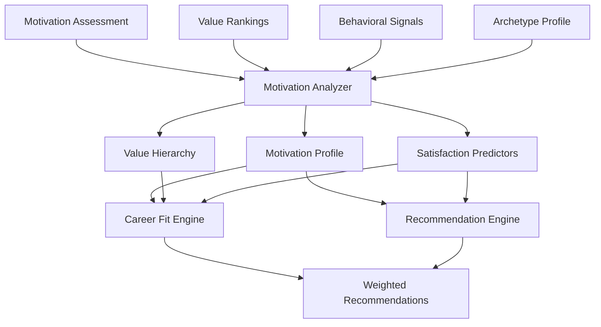

# 05 - Motivation Intelligence

## Purpose

Motivation Intelligence uncovers what drives a student—their intrinsic motivators, values, and desires that influence career satisfaction and performance. By understanding motivation, CareerOS can recommend careers that not only match capabilities but also fulfill deeper needs.

## Problem Solved

- Students often don't know what truly motivates them
- Career choices based on external factors (salary, status) lead to dissatisfaction
- No systematic way to map motivators to career attributes
- Misalignment between what students think they want and what fulfills them
- High attrition in careers due to motivational mismatch

## Inputs

| Input | Source | Format | Frequency |
|-------|--------|--------|-----------|
| Motivation Assessment | Assessment Intelligence | Motivation scores | Per assessment |
| Value Rankings | Student input | Priority list | Periodic |
| Behavioral Signals | Student Intelligence | Engagement patterns | Real-time |
| Career Preferences | Student Intelligence | Interest indications | Continuous |
| Archetype Profile | Archetype Intelligence | Work style data | On classification |
| Context Data | Context Intelligence | Situational factors | On context change |

## Outputs

| Output | Description | Consumers |
|--------|-------------|-----------|
| Motivation Profile | Ranked motivators with scores | Decision Intelligence |
| Value Hierarchy | Core values in priority order | Career Fit Engine |
| Satisfaction Predictors | What will satisfy this student | Recommendation Engine |
| Engagement Drivers | What creates engagement | Action Intelligence |
| Risk Factors | What will demotivate | Career Path Intelligence |
| Motivation Archetype | Motivation-based classification | Mentor Intelligence |

## Dependencies

| Dependency | Purpose |
|------------|---------|
| Assessment Intelligence | Motivation assessment results |
| Student Intelligence | Preference and behavioral data |
| Archetype Intelligence | Work style context |
| Context Intelligence | Situational motivation factors |

## Consumers

| Consumer | Usage |
|----------|-------|
| Career Fit Engine | Weight careers by motivational fit |
| Recommendation Engine | Prioritize fulfilling careers |
| Decision Intelligence | Explain choices through motivation lens |
| Action Intelligence | Motivate through aligned incentives |
| Career Path Intelligence | Design paths that maintain motivation |

## Data Flow



## Key Interfaces

### Motivation API
```typescript
interface MotivationProfile {
  studentId: string;
  motivators: RankedMotivator[];
  values: RankedValue[];
  hygieneFactors: HygieneFactor[];
  satisfactionPredictors: Predictor[];
  riskFactors: RiskFactor[];
  confidence: number;
  derivedAt: Date;
}

interface RankedMotivator {
  type: MotivatorType;
  score: number;
  rank: number;
  evidence: Evidence[];
}

enum MotivatorType {
  MASTERY = 'MASTERY',
  AUTONOMY = 'AUTONOMY',
  PURPOSE = 'PURPOSE',
  RECOGNITION = 'RECOGNITION',
  SECURITY = 'SECURITY',
  GROWTH = 'GROWTH',
  IMPACT = 'IMPACT',
  CREATIVITY = 'CREATIVITY',
  CONNECTION = 'CONNECTION',
  CHALLENGE = 'CHALLENGE'
}

interface MotivationIntelligenceService {
  analyze(studentId: string): Promise<MotivationProfile>;
  getProfile(studentId: string): Promise<MotivationProfile>;
  predictSatisfaction(studentId: string, careerId: string): Promise<SatisfactionPrediction>;
  identifyRisks(studentId: string, careerId: string): Promise<RiskAssessment>;
  suggestMotivators(studentId: string, goal: Goal): Promise<MotivatorSuggestion[]>;
}
```

## Key Engines

| Engine | Purpose | Status |
|--------|---------|--------|
| Motivation Analyzer | Extract and rank motivators | 📋 Planned |
| Value Mapper | Map values to career attributes | 📋 Planned |
| Satisfaction Predictor | Predict career satisfaction | 📋 Planned |
| Risk Identifier | Identify demotivation risks | 📋 Planned |
| Engagement Optimizer | Suggest engagement strategies | 📋 Planned |

## Motivator Framework

| Motivator | Description | Career Indicators | Red Flags |
|-----------|-------------|-------------------|-----------|
| **Mastery** | Becoming expert at something | Deep skill development, complexity | Repetitive, shallow work |
| **Autonomy** | Freedom to choose how to work | Independent roles, flexibility | Micromanagement, rigid structure |
| **Purpose** | Meaningful, impactful work | Mission-driven organizations | Pure profit focus |
| **Recognition** | Being seen and valued | Visible roles, feedback culture | Anonymous, isolated work |
| **Security** | Stability and predictability | Established companies, steady demand | Volatility, uncertainty |
| **Growth** | Continuous advancement | Clear career ladders, learning | Dead-end roles |
| **Impact** | Making a difference | Outcome-oriented roles | Bureaucratic, removed from results |
| **Creativity** | Creating something new | Innovation roles, problem-solving | Rigid processes, no room for ideas |
| **Connection** | Working with people | Collaborative teams, client-facing | Isolated, purely technical |
| **Challenge** | Difficult, stretching goals | Ambitious targets, competition | Easy, unchallenging work |

## Current Status

| Component | Status | Notes |
|-----------|--------|-------|
| Motivation Model | 📋 Planned | Framework defined |
| Assessment Integration | 📋 Planned | Awaiting assessment development |
| Scoring Algorithm | 📋 Planned | Q3 2026 |
| Career Mapping | 📋 Planned | Map motivators to career attributes |
| Validation Framework | 📋 Planned | Long-term outcome tracking |

## Future Improvements

1. **Dynamic Motivation Tracking**: Monitor how motivations evolve
2. **Context-Specific Motivation**: Different motivators in different contexts
3. **Team Motivation Analysis**: How motivations interact in teams
4. **Cultural Motivation Differences**: India-specific motivation patterns
5. **Life Stage Motivation**: How motivations change across life stages

## Audit Findings

| Date | Finding | Severity | Status |
|------|---------|----------|--------|
| 2026-06-02 | Motivation model needs validation | High | Open |
| 2026-06-02 | No India-specific motivation research | Medium | Open |

## Risks

| Risk | Impact | Likelihood | Mitigation |
|------|--------|------------|------------|
| Self-reporting bias | Medium | High | Behavioral signal integration |
| Social desirability | Medium | Medium | Indirect measurement techniques |
| Motivation change | Medium | High | Continuous monitoring |
| Overemphasis on motivation | Medium | Low | Balance with capability fit |
