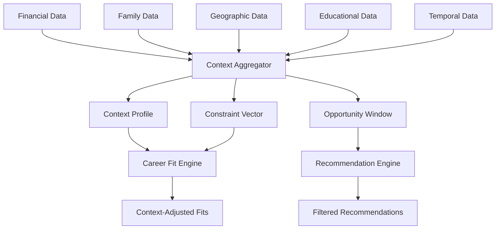

# 06 - Context Intelligence

## Purpose

Context Intelligence captures and maintains the situational context that shapes career decisions—financial constraints, family obligations, geographic location, educational background, and timing factors. This module ensures career recommendations are grounded in reality, not idealized scenarios.

## Problem Solved

- Career advice often ignores student constraints
- One-size-fits-all recommendations fail for students in different situations
- Financial and family pressures are invisible to standard career guidance
- Geographic limitations aren't considered
- Timing and life stage factors are ignored

## Inputs

| Input | Source | Format | Frequency |
|-------|--------|--------|-----------|
| Financial Context | Student input | Financial profile | On change |
| Family Context | Student input | Family obligations | On change |
| Geographic Context | Student input / IP | Location data | On change |
| Educational Context | Student Intelligence | Academic status | Continuous |
| Temporal Context | System | Timing, deadlines | Real-time |
| Constraint Self-Report | Student input | Constraints list | Periodic |
| External Events | External APIs | Market conditions | Periodic |

## Outputs

| Output | Description | Consumers |
|--------|-------------|-----------|
| Context Profile | Complete situational context | All intelligence modules |
| Constraint Vector | Active constraints | Career Fit Engine |
| Opportunity Window | Available options given context | Recommendation Engine |
| Flexibility Score | Degree of freedom | Decision Intelligence |
| Risk Tolerance | Context-adjusted risk capacity | Utility Intelligence |
| Timeline Constraints | Time-bound limitations | Career Path Intelligence |

## Dependencies

| Dependency | Purpose |
|------------|---------|
| Student Intelligence | Educational and demographic context |
| India Intelligence | India-specific contextual factors |
| Founder Intelligence | Founder journey context |
| External Data | Market conditions, opportunities |

## Consumers

| Consumer | Usage |
|----------|-------|
| Career Fit Engine | Adjust fit scores for context |
| Recommendation Engine | Filter by context constraints |
| Decision Intelligence | Context-aware decision support |
| Utility Intelligence | Context-adjusted utility |
| Career Path Intelligence | Timeline-aware path planning |
| Career Reality | Context validation |

## Data Flow



## Key Interfaces

### Context API
```typescript
interface ContextProfile {
  studentId: string;
  financial: FinancialContext;
  family: FamilyContext;
  geographic: GeographicContext;
  educational: EducationalContext;
  temporal: TemporalContext;
  constraints: Constraint[];
  flexibility: FlexibilityScore;
  updatedAt: Date;
}

interface FinancialContext {
  incomeLevel: IncomeLevel;
  savings: number;
  debt: number;
  familySupport: boolean;
  immediateEarningsNeed: boolean;
  runway: number; // months
}

interface FamilyContext {
  dependents: number;
  caregiverResponsibilities: boolean;
  familyExpectations: FamilyExpectation[];
  locationConstraints: boolean;
  financialObligations: number;
}

interface ContextIntelligenceService {
  captureContext(studentId: string, context: ContextInput): Promise<ContextProfile>;
  getContext(studentId: string): Promise<ContextProfile>;
  updateConstraint(studentId: string, constraint: Constraint): Promise<ContextProfile>;
  calculateFlexibility(context: ContextProfile): Promise<FlexibilityScore>;
  identifyOpportunities(context: ContextProfile): Promise<OpportunityWindow>;
  validatePath(context: ContextProfile, path: CareerPath): Promise<ValidationResult>;
}
```

## Key Engines

| Engine | Purpose | Status |
|--------|---------|--------|
| Context Aggregator | Combine all context sources | 📋 Planned |
| Constraint Analyzer | Identify binding constraints | 📋 Planned |
| Opportunity Identifier | Find viable options given constraints | 📋 Planned |
| Flexibility Calculator | Measure degrees of freedom | 📋 Planned |
| Timeline Engine | Model time-based constraints | 📋 Planned |

## Context Dimensions

| Dimension | Factors | Impact on Careers |
|-----------|---------|-------------------|
| **Financial** | Income, savings, debt, runway | Salary requirements, risk tolerance |
| **Family** | Dependents, obligations, expectations | Location, stability needs |
| **Geographic** | City, mobility, visa status | Available opportunities |
| **Educational** | Current status, credentials, gaps | Entry requirements |
| **Temporal** | Age, life stage, urgency | Timeline, shortcuts |
| **Social** | Network, caste, community | Access, barriers |
| **Health** | Physical, mental health considerations | Work demands, stress |

## Current Status

| Component | Status | Notes |
|-----------|--------|-------|
| Context Model | 📋 Planned | Schema defined |
| Financial Context | 📋 Planned | Income bands for India |
| Family Context | 📋 Planned | Cultural factors |
| Geographic Context | 📋 Planned | City-tier mapping |
| Constraint Engine | 📋 Planned | Q3 2026 |
| Opportunity Finder | 📋 Planned | Filtered search |

## Future Improvements

1. **Dynamic Context Tracking**: Monitor context changes over time
2. **Predictive Context**: Anticipate future constraints
3. **Context Optimization**: Suggest context changes to expand options
4. **Peer Context Comparison**: How does context compare to peers
5. **Context-Based Community**: Connect students in similar contexts

## Audit Findings

| Date | Finding | Severity | Status |
|------|---------|----------|--------|
| 2026-06-02 | Need granular India income bands | Medium | Open |
| 2026-06-02 | Family expectation model needs research | Medium | Open |

## Risks

| Risk | Impact | Likelihood | Mitigation |
|------|--------|------------|------------|
| Privacy sensitivity | High | High | Strict access controls, encryption |
| Context changes ignored | Medium | Medium | Change detection, notifications |
| Over-constraint | Medium | Medium | Flexibility scoring, what-if analysis |
| Cultural insensitivity | High | Medium | Local research, diverse team |
