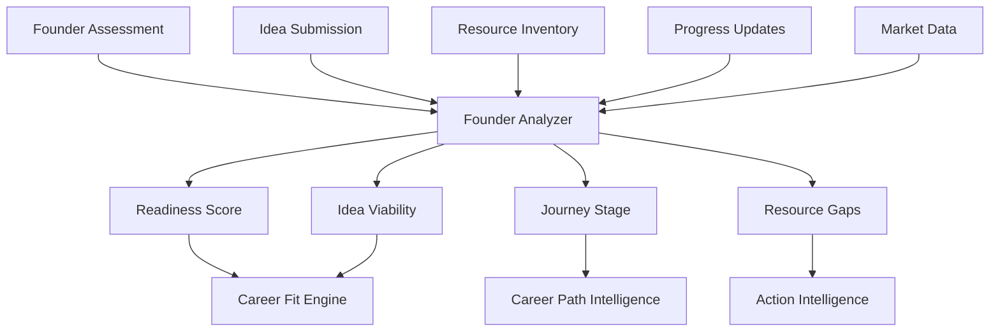

# 07 - Founder Intelligence

## Purpose

Founder Intelligence specializes in supporting students considering or pursuing the entrepreneurial path. It captures founder-specific signals, models startup journey stages, and provides tailored guidance for building companies—from ideation to scaling.

## Problem Solved

- Entrepreneurship guidance is generic and not stage-appropriate
- No systematic assessment of founder readiness
- Difficult to evaluate startup ideas objectively
- Founder journey is isolating without peer context
- Risk assessment for entrepreneurship is inadequate

## Inputs

| Input | Source | Format | Frequency |
|-------|--------|--------|-----------|
| Founder Assessment | Assessment Intelligence | Founder trait scores | Per assessment |
| Startup Ideas | Student input | Idea descriptions | On submission |
| Venture Stage | Student input / tracking | Stage classification | On change |
| Resource Inventory | Student input | Skills, network, capital | Periodic |
| Market Research | External / Student | Market data | On research |
| Progress Tracking | Student updates | Milestones achieved | Continuous |
| Founder Context | Context Intelligence | Founder-specific constraints | Continuous |

## Outputs

| Output | Description | Consumers |
|--------|-------------|-----------|
| Founder Readiness Score | Preparedness for founding | Decision Intelligence |
| Idea Viability Assessment | Startup idea evaluation | Recommendation Engine |
| Journey Stage | Current stage in founder path | Career Path Intelligence |
| Resource Gaps | Missing resources for success | Action Intelligence |
| Risk Assessment | Founder-specific risks | Utility Intelligence |
| Peer Benchmarks | Comparison to other founders | Analytics |
| Next Milestones | Recommended next steps | Action Intelligence |

## Dependencies

| Dependency | Purpose |
|------------|---------|
| Assessment Intelligence | Founder trait assessment |
| Context Intelligence | Founder constraints |
| India Intelligence | India startup ecosystem data |
| Career Intelligence | Alternative career comparison |
| External APIs | Market data, funding data |

## Consumers

| Consumer | Usage |
|----------|-------|
| Recommendation Engine | Include entrepreneurship options |
| Career Fit Engine | Weight founder fit |
| Career Path Intelligence | Founder-specific path planning |
| Decision Intelligence | Compare founder vs. employment |
| Utility Intelligence | Founder-specific utility calculation |
| Mentor Intelligence | Match with founder mentors |

## Data Flow



## Key Interfaces

### Founder API
```typescript
interface FounderProfile {
  studentId: string;
  readiness: ReadinessScore;
  traits: FounderTrait[];
  ideas: StartupIdea[];
  stage: FounderStage;
  resources: ResourceInventory;
  gaps: ResourceGap[];
  milestones: Milestone[];
  riskProfile: FounderRiskProfile;
}

enum FounderStage {
  EXPLORING = 'EXPLORING',
  IDEATING = 'IDEATING',
  VALIDATING = 'VALIDATING',
  BUILDING = 'BUILDING',
  LAUNCHING = 'LAUNCHING',
  SCALING = 'SCALING',
  PIVOTING = 'PIVOTING'
}

interface StartupIdea {
  id: string;
  description: string;
  market: MarketSegment;
  viability: ViabilityScore;
  differentiation: DifferentiationScore;
  timing: TimingScore;
  risks: Risk[];
}

interface FounderIntelligenceService {
  assessReadiness(studentId: string): Promise<ReadinessScore>;
  evaluateIdea(studentId: string, idea: IdeaInput): Promise<IdeaEvaluation>;
  getJourneyStage(studentId: string): Promise<FounderStage>;
  identifyGaps(studentId: string): Promise<ResourceGap[]>;
  suggestMilestones(studentId: string): Promise<Milestone[]>;
  compareToEmployment(studentId: string): Promise<ComparisonResult>;
}
```

## Key Engines

| Engine | Purpose | Status |
|--------|---------|--------|
| Readiness Assessor | Evaluate founder preparedness | 📋 Planned |
| Idea Evaluator | Assess startup idea viability | 📋 Planned |
| Stage Tracker | Track journey progression | 📋 Planned |
| Gap Analyzer | Identify missing resources | 📋 Planned |
| Risk Modeler | Founder-specific risk modeling | 📋 Planned |
| Peer Matcher | Connect with similar founders | 📋 Planned |

## Founder Journey Stages

| Stage | Description | Key Activities | Success Metrics |
|-------|-------------|----------------|-----------------|
| **Exploring** | Considering entrepreneurship | Learning, networking | Knowledge, connections |
| **Ideating** | Generating startup ideas | Problem research, ideation | Idea pipeline |
| **Validating** | Testing idea viability | Customer interviews, MVP tests | Validation signals |
| **Building** | Developing the product | MVP development, team building | Product progress |
| **Launching** | Going to market | Launch, initial customers | First revenue |
| **Scaling** | Growing the business | Fundraising, team expansion | Growth metrics |
| **Pivoting** | Changing direction | Reassessment, new direction | Learning, new hypothesis |

## Founder Traits Assessed

| Trait | Description | Assessment Method |
|-------|-------------|-------------------|
| **Risk Tolerance** | Comfort with uncertainty | Scenario-based |
| **Resilience** | Ability to bounce back from setbacks | Past experience analysis |
| **Vision** | Ability to see future possibilities | Creative exercises |
| **Execution** | Ability to get things done | Project history |
| **Adaptability** | Willingness to change course | Situational judgment |
| **Resourcefulness** | Ability to do more with less | Problem-solving tasks |
| **Influence** | Ability to persuade and lead | Peer feedback, scenarios |
| **Domain Expertise** | Knowledge in target market | Self-report + validation |

## Current Status

| Component | Status | Notes |
|-----------|--------|-------|
| Founder Model | 📋 Planned | Framework defined |
| Assessment Integration | 📋 Planned | Founder trait assessment |
| Idea Evaluation | 📋 Planned | Framework in research |
| Stage Tracking | 📋 Planned | Milestone definitions |
| India Ecosystem Data | 📋 Planned | Local market integration |

## Future Improvements

1. **Idea Marketplace**: Connect founders with promising ideas
2. **Co-founder Matching**: Find complementary co-founders
3. **Investor Warm Intros**: Connect with India-focused investors
4. **Accelerator Recommendations**: Match with appropriate programs
5. **Failure Recovery**: Support for failed founders

## Audit Findings

| Date | Finding | Severity | Status |
|------|---------|----------|--------|
| 2026-06-02 | Need India-specific founder research | High | Open |
| 2026-06-02 | Idea evaluation framework needs validation | Medium | Open |

## Risks

| Risk | Impact | Likelihood | Mitigation |
|------|--------|------------|------------|
| Survivorship bias | Medium | High | Include failed founder data |
| Over-optimism | Medium | High | Realistic probability estimates |
| Ecosystem differences | High | Medium | India-specific models |
| High failure rate | Medium | High | Honest risk communication |
