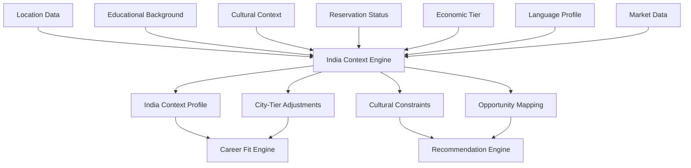

# 08 - India Intelligence

## Purpose

India Intelligence encapsulates all India-specific context, constraints, and opportunities that shape career decisions for Indian students. From city-tier economic differences to cultural expectations, from entrance exams to family obligations, this module ensures CareerOS understands the unique landscape of Indian careers.

## Problem Solved

- Global career guidance fails for Indian context
- City-tier differences (Tier 1/2/3) are ignored
- Cultural and family factors are invisible
- Entrance exam system is not modeled
- India-specific opportunities are missed
- Caste, reservation, and diversity factors unaddressed

## Inputs

| Input | Source | Format | Frequency |
|-------|--------|--------|-----------|
| Location Data | Student input | City, state, tier | On change |
| Educational Background | Student Intelligence | Board, college tier | On change |
| Cultural Context | Student input | Family structure, expectations | On change |
| Reservation Status | Student input | Category (SC/ST/OBC/General) | Once |
| Economic Tier | Student input | Income band | On change |
| Language Profile | Student input | Languages known | On change |
| Market Data | External APIs | India job market data | Periodic |
| Regulatory Data | External | Policy changes, regulations | On change |

## Outputs

| Output | Description | Consumers |
|--------|-------------|-----------|
| India Context Profile | Complete India-specific context | All modules |
| City-Tier Adjustments | Location-based opportunity adjustments | Career Fit Engine |
| Cultural Constraints | Family and cultural factors | Context Intelligence |
| Exam Readiness | Entrance exam preparation status | Career Path Intelligence |
| Market Realities | India job market context | Career Reality |
| Opportunity Mapping | India-specific opportunities | Recommendation Engine |
| Risk Factors | India-specific risks | Decision Intelligence |

## Dependencies

| Dependency | Purpose |
|------------|---------|
| Student Intelligence | Student profile data |
| Context Intelligence | General context framework |
| External Data | Indian job market data |
| Regulatory Databases | Policy and regulation updates |

## Consumers

| Consumer | Usage |
|----------|-------|
| Career Fit Engine | Adjust fits for India context |
| Recommendation Engine | Include India-specific opportunities |
| Career Reality | Validate against India realities |
| Decision Intelligence | India-aware decision support |
| Career Path Intelligence | India-specific path planning |
| Mentor Intelligence | Match with India-based mentors |

## Data Flow



## Key Interfaces

### India Intelligence API
```typescript
interface IndiaContextProfile {
  studentId: string;
  location: IndiaLocation;
  education: IndiaEducation;
  culture: IndiaCulturalContext;
  economics: IndiaEconomicContext;
  opportunities: IndiaOpportunityMap;
  constraints: IndiaConstraint[];
}

interface IndiaLocation {
  city: string;
  state: State;
  tier: CityTier;
  proximityToMetro: number;
  ecosystemMaturity: EcosystemMaturity;
}

enum CityTier {
  TIER_1 = 'TIER_1',
  TIER_2 = 'TIER_2',
  TIER_3 = 'TIER_3',
  RURAL = 'RURAL'
}

interface IndiaIntelligenceService {
  buildContext(studentId: string): Promise<IndiaContextProfile>;
  getOpportunities(context: IndiaContextProfile): Promise<Opportunity[]>;
  adjustForTier(careers: Career[], tier: CityTier): Promise<AdjustedCareer[]>;
  validatePath(context: IndiaContextProfile, path: CareerPath): Promise<ValidationResult>;
  getExamReadiness(studentId: string, exam: EntranceExam): Promise<ReadinessScore>;
  getMarketReality(careerId: string, location: IndiaLocation): Promise<MarketReality>;
}
```

## Key Engines

| Engine | Purpose | Status |
|--------|---------|--------|
| Context Builder | Assemble India-specific context | 📋 Planned |
| Tier Adjuster | Adjust opportunities by city tier | 📋 Planned |
| Market Reality Engine | Model India job market conditions | 📋 Planned |
| Exam Readiness Tracker | Track entrance exam preparation | 📋 Planned |
| Opportunity Mapper | Find India-specific opportunities | 📋 Planned |
| Cultural Constraint Modeler | Model cultural factors | 📋 Planned |

## India-Specific Factors

### City Tiers

| Tier | Examples | Characteristics | Career Implications |
|------|----------|-----------------|---------------------|
| **Tier 1** | Delhi, Mumbai, Bangalore, Hyderabad | High salaries, MNCs, startups, high cost | Maximum opportunities, high competition |
| **Tier 2** | Pune, Jaipur, Lucknow, Kochi | Growing ecosystem, moderate costs | Good opportunities, lower competition |
| **Tier 3** | Smaller cities | Limited opportunities, low costs | Fewer options, need remote work |
| **Rural** | Villages | Agriculture, government jobs | Limited private sector, migration needed |

### Educational System

| Factor | Impact | Modeling Approach |
|--------|--------|-------------------|
| Board (CBSE/ICSE/State) | College admissions, career readiness | Weighting in assessments |
| College Tier | Employer perception, opportunities | Adjustment in fit calculations |
| Entrance Exams | JEE, NEET, CAT, etc. | Path requirements, readiness tracking |
| Reservation Category | Access to opportunities | Constraint modeling |
| Gap Years | Career impact | Risk assessment |

### Cultural Factors

| Factor | Description | Impact on Careers |
|--------|-------------|-------------------|
| Family Expectations | Pressure for stable/government jobs | Risk tolerance, career choices |
| Marriage Timing | Career interruptions for women | Timeline planning |
| Joint Family | Location constraints | Geographic flexibility |
| Community Networks | Access to opportunities | Networking strategies |
| Dowry/Savings Pressure | Financial urgency | Salary prioritization |

## Current Status

| Component | Status | Notes |
|-----------|--------|-------|
| India Context Model | 📋 Planned | Framework defined |
| City-Tier Database | 📋 Planned | Tier classification ready |
| Market Data Integration | 📋 Planned | External API research |
| Cultural Factors | 📋 Planned | Requires research |
| Exam Tracking | 📋 Planned | Major exams cataloged |
| Regulatory Factors | 📋 Planned | Policy monitoring setup |

## Future Improvements

1. **Regional Language Support**: Multi-language career content
2. **Micro-Market Data**: City-specific salary and opportunity data
3. **Cultural Sensitivity Training**: For mentor matching
4. **Diaspora Pathways**: NRI return and abroad opportunities
5. **Government Job Tracking**: UPSC, SSC, state exams

## Audit Findings

| Date | Finding | Severity | Status |
|------|---------|----------|--------|
| 2026-06-02 | Need primary research on cultural factors | High | Open |
| 2026-06-02 | City-tier salary data needs validation | Medium | Open |

## Risks

| Risk | Impact | Likelihood | Mitigation |
|------|--------|------------|------------|
| Regional bias | High | Medium | Diverse research team |
| Rapid market change | Medium | High | Continuous data updates |
| Cultural insensitivity | High | Medium | Local advisors, feedback loops |
| Over-generalization | Medium | Medium | Granular segmentation |
