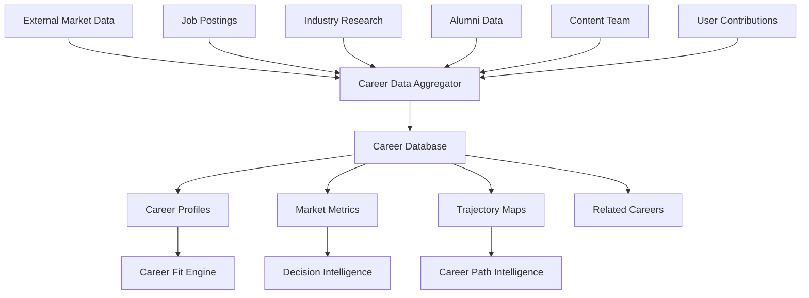

# 09 - Career Intelligence

## Purpose

Career Intelligence manages the universe of career data—professions, roles, industries, and trajectories. It maintains comprehensive, up-to-date information about career requirements, skills, compensation, demand, and pathways, serving as the foundational knowledge base for all career-related intelligence.

## Problem Solved

- Career information is fragmented across sources
- No unified, structured career database
- Career requirements change but data doesn't update
- No systematic mapping of career relationships
- Outdated salary and demand information
- Missing India-specific career data

## Inputs

| Input | Source | Format | Frequency |
|-------|--------|--------|-----------|
| Career Definitions | Research / Content team | Structured data | On update |
| Market Data | External APIs | Salary, demand data | Weekly |
| Skill Taxonomy | LinkedIn, industry sources | Skill mappings | Monthly |
| Trajectory Data | Alumni, professionals | Path examples | Continuous |
| Requirement Data | Employers, job postings | Requirements | Weekly |
| Industry Trends | Market research | Trend reports | Monthly |
| India-Specific Data | India research | Localized data | Monthly |

## Outputs

| Output | Description | Consumers |
|--------|-------------|-----------|
| Career Database | Complete career information | All modules |
| Career Profiles | Individual career details | Career Fit Engine |
| Market Metrics | Salary, demand, growth | Decision Intelligence |
| Trajectory Maps | Typical career paths | Career Path Intelligence |
| Requirement Profiles | Skills, education needed | Career Fit Engine |
| Related Careers | Career similarity graph | Recommendation Engine |
| Industry Data | Sector-level information | Context Intelligence |

## Dependencies

| Dependency | Purpose |
|------------|---------|
| Career Taxonomy | Classification system |
| External Data Sources | Market data, job postings |
| Industry Partners | Real-time requirement updates |
| Content Team | Career content creation |

## Consumers

| Consumer | Usage |
|----------|-------|
| Career Fit Engine | Career data for fit calculation |
| Career Taxonomy | Classification reference |
| Recommendation Engine | Career universe for recommendations |
| Career Path Intelligence | Trajectory data for path planning |
| Decision Intelligence | Market data for decision support |
| Career Reality | Reality validation data |

## Data Flow



## Key Interfaces

### Career API
```typescript
interface Career {
  id: string;
  title: string;
  category: CareerCategory;
  industry: Industry;
  description: string;
  requirements: Requirements;
  marketData: MarketData;
  trajectories: CareerTrajectory[];
  relatedCareers: string[];
  skills: Skill[];
  indiaContext?: IndiaCareerData;
}

interface MarketData {
  salaryRange: SalaryRange;
  demandLevel: DemandLevel;
  growthRate: number;
  entryBarrier: EntryBarrier;
  remoteFriendly: boolean;
  experienceRequirements: Map<Level, Requirement>;
}

interface CareerIntelligenceService {
  getCareer(id: string): Promise<Career>;
  searchCareers(query: CareerQuery): Promise<Career[]>;
  getMarketData(careerId: string, location?: Location): Promise<MarketData>;
  getTrajectories(careerId: string): Promise<CareerTrajectory[]>;
  getRelatedCareers(careerId: string): Promise<Career[]>;
  getRequirements(careerId: string): Promise<Requirements>;
  updateMarketData(careerId: string, data: MarketData): Promise<void>;
}
```

## Key Engines

| Engine | Purpose | Status |
|--------|---------|--------|
| Data Aggregator | Collect and normalize career data | 🚧 In Progress |
| Market Data Engine | Track salary, demand, trends | 🚧 In Progress |
| Trajectory Mapper | Map typical career paths | 📋 Planned |
| Similarity Engine | Calculate career relationships | 📋 Planned |
| India Localization | India-specific career data | 📋 Planned |
| Quality Monitor | Data freshness and accuracy | 📋 Planned |

## Career Data Model

| Category | Attributes | Update Frequency |
|----------|------------|------------------|
| **Basic Info** | Title, description, category, industry | Quarterly |
| **Requirements** | Education, skills, certifications | Monthly |
| **Market Data** | Salary, demand, growth | Weekly |
| **Trajectory** | Career paths, progression | Quarterly |
| **Skills** | Required skills, skill importance | Monthly |
| **India Data** | India-specific context, salaries | Monthly |

## India-Specific Career Considerations

| Factor | Data Captured | Impact |
|--------|---------------|--------|
| **Salary Ranges** | By city tier, experience level | Reality alignment |
| **Entrance Exams** | Required exams, difficulty | Path planning |
| **Reservation** | Government job quotas | Opportunity mapping |
| **Regional Demand** | State-wise opportunity distribution | Geographic fit |
| **Cultural Status** | Social perception of careers | Expectation management |

## Current Status

| Component | Status | Notes |
|-----------|--------|-------|
| Career Schema | ✅ Complete | Data model defined |
| Core Career Database | 🚧 In Progress | 200+ careers added |
| Market Data Integration | 🚧 In Progress | API connections setup |
| Trajectory Mapping | 📋 Planned | Alumni data collection |
| India Localization | 📋 Planned | Local research |
| Quality Assurance | 📋 Planned | Data validation rules |

## Future Improvements

1. **Real-Time Updates**: Live job posting analysis
2. **Skill Forecasting**: Predict emerging skill requirements
3. **Career Videos**: Rich media content per career
4. **Day-in-Life**: Detailed workday simulations
5. **Alumni Network**: Connect with professionals in each career

## Audit Findings

| Date | Finding | Severity | Status |
|------|---------|----------|--------|
| 2026-06-02 | Need more India-specific salary data | High | Open |
| 2026-06-02 | Career trajectories need validation | Medium | Open |

## Risks

| Risk | Impact | Likelihood | Mitigation |
|------|--------|------------|------------|
| Data staleness | High | Medium | Automated refresh, freshness indicators |
| Inaccurate market data | High | Medium | Multiple sources, confidence scores |
| Coverage gaps | Medium | Medium | Priority queue for missing careers |
| India data quality | High | Medium | Local partnerships |
