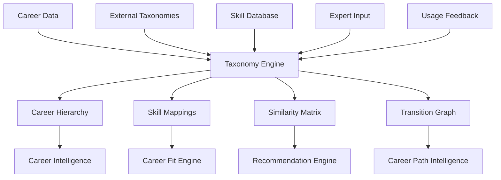

# 10 - Career Taxonomy

## Purpose

Career Taxonomy provides a structured classification system for all careers, enabling meaningful organization, search, comparison, and recommendation. It defines hierarchical relationships between careers, skills, industries, and attributes that power the entire career intelligence system.

## Problem Solved

- Careers lack consistent categorization
- No standard language for describing careers
- Difficult to find similar or related careers
- Career transitions are hard to model
- Skills-to-career mappings are inconsistent
- Search and filtering don't work effectively

## Inputs

| Input | Source | Format | Frequency |
|-------|--------|--------|-----------|
| Career Data | Career Intelligence | Career objects | Continuous |
| Skill Taxonomies | External (LinkedIn, ONET) | Skill hierarchies | Quarterly |
| Industry Classifications | External (NAICS, ISIC) | Industry codes | Annual |
| Educational Taxonomies | External (NCES, UGC) | Education fields | Annual |
| Expert Input | Domain experts | Manual classifications | On review |
| Usage Data | System analytics | Search patterns | Continuous |
| Feedback Data | User feedback | Classification issues | Continuous |

## Outputs

| Output | Description | Consumers |
|--------|-------------|-----------|
| Career Hierarchy | Parent-child career relationships | Career Intelligence |
| Skill Mappings | Career-skill relationships | Career Fit Engine |
| Industry Tree | Industry classifications | Filtering, search |
| Attribute Taxonomy | Career attribute definitions | All modules |
| Similarity Matrix | Career-to-career similarity | Recommendation Engine |
| Transition Graph | Viable career transitions | Career Path Intelligence |
| Search Indexes | Optimized for search | All modules |

## Dependencies

| Dependency | Purpose |
|------------|---------|
| Career Intelligence | Career data to classify |
| External Taxonomies | Standard classification bases |
| Skill Database | Skill definitions and mappings |
| Expert Network | Validation and refinement |

## Consumers

| Consumer | Usage |
|----------|-------|
| Career Intelligence | Classification storage |
| Career Fit Engine | Skill and attribute matching |
| Recommendation Engine | Similarity-based recommendations |
| Career Path Intelligence | Transition path modeling |
| Search Service | Faceted search, filtering |
| Analytics | Categorization, segmentation |

## Data Flow



## Key Interfaces

### Taxonomy API
```typescript
interface CareerTaxonomy {
  careers: CareerNode[];
  industries: IndustryNode[];
  skills: SkillNode[];
  attributes: AttributeDefinition[];
}

interface CareerNode {
  id: string;
  title: string;
  category: CareerCategory;
  parent?: string;
  children: string[];
  related: string[];
  skills: SkillWeight[];
  attributes: AttributeValue[];
  level: CareerLevel;
}

interface CareerTaxonomyService {
  getHierarchy(root?: string): Promise<CareerHierarchy>;
  getCareerNode(careerId: string): Promise<CareerNode>;
  findSimilar(careerId: string, limit?: number): Promise<SimilarCareer[]>;
  getTransitions(from: string): Promise<CareerTransition[]>;
  classifyCareer(career: CareerInput): Promise<CareerNode>;
  searchByCriteria(criteria: SearchCriteria): Promise<Career[]>;
  getSkillPath(careerId: string, currentSkills: Skill[]): Promise<SkillGap[]>;
}
```

## Key Engines

| Engine | Purpose | Status |
|--------|---------|--------|
| Classification Engine | Auto-classify new careers | 🚧 In Progress |
| Similarity Calculator | Compute career similarity | 🚧 In Progress |
| Hierarchy Manager | Maintain parent-child relationships | 🚧 In Progress |
| Transition Modeler | Identify viable transitions | 📋 Planned |
| Skill Mapper | Map skills to careers | 🚧 In Progress |
| Search Indexer | Build search indexes | 📋 Planned |

## Taxonomy Structure

### Career Hierarchy

```
Technology
├── Software Engineering
│   ├── Frontend Developer
│   ├── Backend Developer
│   ├── Full Stack Developer
│   ├── Mobile Developer
│   └── DevOps Engineer
├── Data Science
│   ├── Data Analyst
│   ├── Data Scientist
│   └── Machine Learning Engineer
└── Product
    ├── Product Manager
    └── Product Owner

Business
├── Finance
│   ├── Investment Banking
│   ├── Financial Analyst
│   └── Accountant
├── Marketing
│   ├── Digital Marketing
│   ├── Brand Manager
│   └── Growth Hacker
└── Consulting
    ├── Strategy Consultant
    └── Management Consultant

... (continues for all domains)
```

### Career Categories

| Category | Description | Examples |
|----------|-------------|----------|
| **Technology** | Tech creation and maintenance | Developer, Data Scientist |
| **Business** | Commercial operations | Manager, Consultant |
| **Creative** | Design and content creation | Designer, Writer |
| **Healthcare** | Medical and wellness | Doctor, Therapist |
| **Education** | Teaching and training | Teacher, Trainer |
| **Government** | Public sector | IAS, PSUs |
| **Research** | Scientific research | Scientist, Researcher |
| **Trades** | Skilled manual work | Electrician, Plumber |

### Career Levels

| Level | Description | Typical Experience |
|-------|-------------|-------------------|
| **Entry** | Starting positions | 0-2 years |
| **Junior** | Developing professionals | 2-5 years |
| **Mid** | Independent contributors | 5-10 years |
| **Senior** | Expert individual contributors | 10+ years |
| **Lead** | Leading small teams | 8+ years |
| **Management** | Managing teams/functions | 10+ years |
| **Executive** | Strategic leadership | 15+ years |

## Current Status

| Component | Status | Notes |
|-----------|--------|-------|
| Taxonomy Schema | ✅ Complete | Data model defined |
| Core Hierarchy | 🚧 In Progress | 15 top categories defined |
| Skill Mappings | 🚧 In Progress | Mapping careers to skills |
| Similarity Scoring | 🚧 In Progress | Algorithm development |
| Transition Graph | 📋 Planned | Path analysis |
| Search Indexes | 📋 Planned | Elasticsearch setup |

## Future Improvements

1. **Dynamic Taxonomy**: Self-updating based on market changes
2. **Cross-Industry Mappings**: Skills that transfer across industries
3. **Emerging Career Detection**: Auto-identify new career types
4. **Personal Taxonomy**: Student-specific career groupings
5. **Global-Local Mapping**: International career equivalencies

## Audit Findings

| Date | Finding | Severity | Status |
|------|---------|----------|--------|
| 2026-06-02 | Need India-specific career categories | High | Open |
| 2026-06-02 | Skill taxonomy needs alignment with Indian job market | Medium | Open |

## Risks

| Risk | Impact | Likelihood | Mitigation |
|------|--------|------------|------------|
| Over-classification | Medium | Medium | Balance granularity with usability |
| Stale taxonomy | High | Medium | Regular review, change detection |
| Cultural bias | High | Medium | India-specific taxonomy team |
| Maintenance burden | Medium | High | Automated classification tools |
