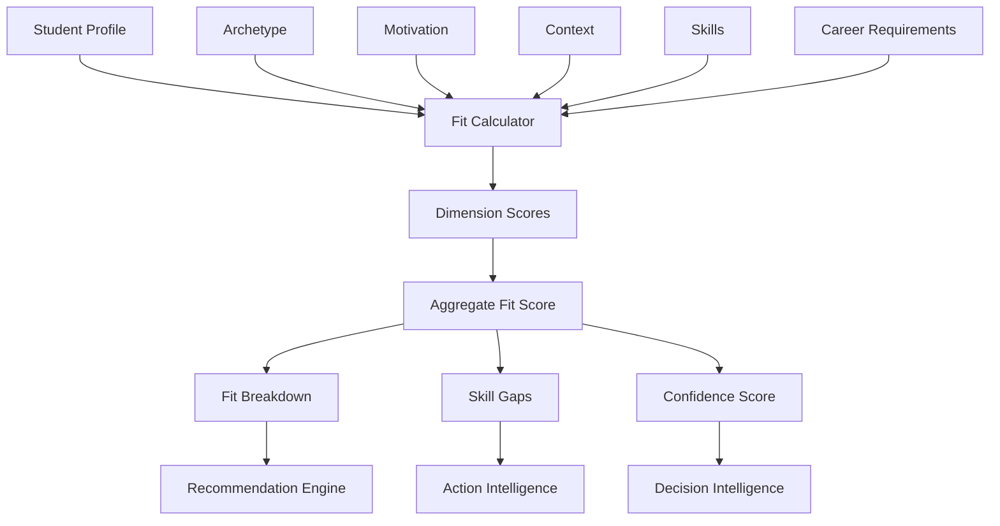

# 11 - Career Fit Engine

## Purpose

Career Fit Engine calculates how well a student fits with specific careers by analyzing multi-dimensional alignment—skills match, archetype compatibility, motivation alignment, context feasibility, and market readiness. It produces quantified fit scores that power recommendations.

## Problem Solved

- Career recommendations lack quantitative basis
- Multiple fit factors are not integrated
- No systematic way to compare career options
- Student-career matching is subjective
- Trade-offs between different fit dimensions are unclear

## Inputs

| Input | Source | Format | Frequency |
|-------|--------|--------|-----------|
| Student Profile | Student Intelligence | Complete profile | On update |
| Archetype Profile | Archetype Intelligence | Archetype classification | On classification |
| Motivation Profile | Motivation Intelligence | Motivation scores | On analysis |
| Context Profile | Context Intelligence | Situational context | On change |
| Career Data | Career Intelligence | Career requirements | On update |
| Skill Assessments | Assessment Intelligence | Skill scores | Per assessment |
| India Context | India Intelligence | India-specific factors | On change |

## Outputs

| Output | Description | Consumers |
|--------|-------------|-----------|
| Fit Scores | 0-100 fit score per career | Recommendation Engine |
| Fit Breakdown | Dimension-by-dimension scores | Decision Intelligence |
| Fit Confidence | Reliability of fit score | Decision Intelligence |
| Skill Gaps | Missing skills for target career | Action Intelligence |
| Gap Severity | How critical each gap is | Career Path Intelligence |
| Improvement Path | How to increase fit | Action Intelligence |

## Dependencies

| Dependency | Purpose |
|------------|---------|
| Student Intelligence | Student profile data |
| Archetype Intelligence | Work style compatibility |
| Motivation Intelligence | Motivation alignment |
| Context Intelligence | Constraint feasibility |
| Career Intelligence | Career requirements |
| India Intelligence | India-specific adjustments |
| Career Taxonomy | Skill and attribute mappings |

## Consumers

| Consumer | Usage |
|----------|-------|
| Recommendation Engine | Rank careers by fit |
| Decision Intelligence | Explain fit factors |
| Action Intelligence | Suggest fit improvements |
| Career Path Intelligence | Plan path to improve fit |
| Utility Intelligence | Fit-weighted utility |
| Outcome Tracking | Validate fit predictions |

## Data Flow



## Key Interfaces

### Career Fit API
```typescript
interface CareerFit {
  studentId: string;
  careerId: string;
  overallScore: number;
  dimensions: DimensionScore[];
  confidence: number;
  gaps: SkillGap[];
  strengths: FitStrength[];
  calculatedAt: Date;
}

interface DimensionScore {
  dimension: FitDimension;
  score: number;
  weight: number;
  details: DimensionDetail[];
}

enum FitDimension {
  SKILL_MATCH = 'SKILL_MATCH',
  ARCHETYPE_COMPATIBILITY = 'ARCHETYPE_COMPATIBILITY',
  MOTIVATION_ALIGNMENT = 'MOTIVATION_ALIGNMENT',
  CONTEXT_FEASIBILITY = 'CONTEXT_FEASIBILITY',
  MARKET_READINESS = 'MARKET_READINESS',
  INTEREST_ALIGNMENT = 'INTEREST_ALIGNMENT'
}

interface CareerFitEngine {
  calculateFit(studentId: string, careerId: string): Promise<CareerFit>;
  calculateFits(studentId: string, careerIds: string[]): Promise<CareerFit[]>;
  getTopFits(studentId: string, limit: number): Promise<CareerFit[]>;
  explainFit(fit: CareerFit): Promise<FitExplanation>;
  identifyGaps(studentId: string, careerId: string): Promise<SkillGap[]>;
  suggestImprovements(fit: CareerFit): Promise<ImprovementSuggestion[]>;
}
```

## Key Engines

| Engine | Purpose | Status |
|--------|---------|--------|
| Skill Matcher | Compare student skills to requirements | 📋 Planned |
| Archetype Comparator | Assess archetype-career compatibility | 📋 Planned |
| Motivation Aligner | Match motivators to career attributes | 📋 Planned |
| Context Validator | Check context constraints | 📋 Planned |
| Market Readiness Assessor | Evaluate entry readiness | 📋 Planned |
| Score Aggregator | Weight and combine dimensions | 📋 Planned |
| Gap Analyzer | Identify missing qualifications | 📋 Planned |

## Fit Dimensions

| Dimension | Weight | Description | Calculation |
|-----------|--------|-------------|-------------|
| **Skill Match** | 30% | Alignment between skills and requirements | Jaccard similarity + proficiency |
| **Archetype Compatibility** | 20% | Work style fit with career demands | Archetype-career matrix |
| **Motivation Alignment** | 20% | Career satisfies key motivators | Motivator-career mapping |
| **Context Feasibility** | 15% | Career viable given constraints | Constraint satisfaction |
| **Market Readiness** | 10% | Student ready for market entry | Experience, portfolio, network |
| **Interest Alignment** | 5% | Student interest in field | Interest inventory match |

## Fit Score Interpretation

| Score | Interpretation | Recommendation |
|-------|---------------|----------------|
| 90-100 | Excellent fit | Highly recommended |
| 80-89 | Strong fit | Recommended |
| 70-79 | Good fit | Consider with caveats |
| 60-69 | Moderate fit | Requires development |
| 50-59 | Weak fit | Significant gaps |
| <50 | Poor fit | Not recommended |

## Current Status

| Component | Status | Notes |
|-----------|--------|-------|
| Fit Model | 📋 Planned | Framework defined |
| Dimension Algorithms | 📋 Planned | Q3 2026 |
| Skill Matching | 📋 Planned | Requires skill taxonomy |
| Archetype Compatibility | 📋 Planned | Archetype-career matrix |
| Score Aggregation | 📋 Planned | Weight tuning needed |
| Gap Analysis | 📋 Planned | Path identification |

## Future Improvements

1. **Dynamic Weights**: Personalize dimension weights per student
2. **Contextual Fit**: Different fits for different contexts (location, timing)
3. **Predictive Fit**: Project future fit after skill development
4. **Fit Trajectory**: How fit changes over career path
5. **Peer Comparison**: Fit relative to similar students

## Audit Findings

| Date | Finding | Severity | Status |
|------|---------|----------|--------|
| 2026-06-02 | Dimension weights need validation | High | Open |
| 2026-06-02 | Need India-specific fit factors | Medium | Open |

## Risks

| Risk | Impact | Likelihood | Mitigation |
|------|--------|------------|------------|
| Over-reliance on scores | Medium | Medium | Provide explanations, not just scores |
| Weight misalignment | High | Medium | A/B testing, outcome validation |
| Missing dimensions | Medium | Medium | Continuous research, user feedback |
| Score gaming | Low | Low | Multi-source validation |
