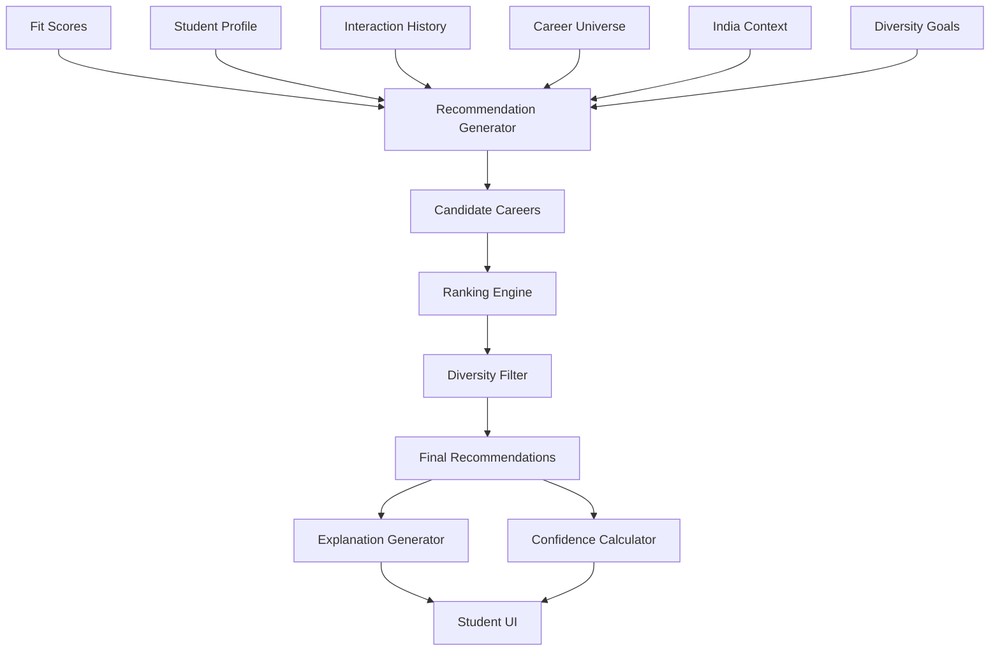

# 12 - Recommendation Engine

## Purpose

Recommendation Engine generates personalized career recommendations by ranking careers based on fit scores, diversity, novelty, and strategic value. It balances relevance with exploration, ensuring students discover both obvious matches and unexpected opportunities.

## Problem Solved

- Students only know about a limited set of careers
- Popular careers overshadow better fits
- No personalization in career guidance
- Missing out on emerging or niche opportunities
- Recommendations don't adapt to student feedback

## Inputs

| Input | Source | Format | Frequency |
|-------|--------|--------|-----------|
| Fit Scores | Career Fit Engine | CareerFit objects | Per calculation |
| Student Profile | Student Intelligence | Complete profile | On update |
| Career Universe | Career Intelligence | All careers | On update |
| India Context | India Intelligence | India factors | On change |
| Interaction History | Student Intelligence | Engagement data | Real-time |
| Feedback Data | Student input | Ratings, choices | On feedback |
| Exclusions | Student input | Rejected careers | On rejection |
| Diversity Goals | System config | Diversity parameters | Configurable |

## Outputs

| Output | Description | Consumers |
|--------|-------------|-----------|
| Ranked Recommendations | Ordered list of careers | Student UI |
| Recommendation Sets | Themed recommendation groups | Exploration UI |
| Explanation | Why each was recommended | Decision Intelligence |
| Diversity Metrics | Coverage of recommendation types | Analytics |
| Confidence Levels | Certainty per recommendation | Decision Intelligence |
| Refresh Suggestions | When to update recommendations | Notification system |

## Dependencies

| Dependency | Purpose |
|------------|---------|
| Career Fit Engine | Primary ranking input |
| Student Intelligence | Profile and history |
| Career Intelligence | Career data |
| India Intelligence | India-specific filtering |
| Career Taxonomy | Similarity, category data |
| Decision Intelligence | Explanation generation |

## Consumers

| Consumer | Usage |
|----------|-------|
| Student UI | Display recommendations |
| Decision Intelligence | Support decision-making |
| Action Intelligence | Next steps per recommendation |
| Analytics | Track recommendation quality |
| Notification System | Alert to new recommendations |

## Data Flow



## Key Interfaces

### Recommendation API
```typescript
interface Recommendation {
  careerId: string;
  rank: number;
  fitScore: number;
  category: RecommendationCategory;
  explanation: RecommendationExplanation;
  confidence: number;
  diversityTag?: string;
  actions: RecommendedAction[];
}

enum RecommendationCategory {
  STRONG_FIT = 'STRONG_FIT',
  EMERGING_OPPORTUNITY = 'EMERGING_OPPORTUNITY',
  SKILL_BRIDGE = 'SKILL_BRIDGE',
  CONTEXT_OPTIMIZED = 'CONTEXT_OPTIMIZED',
  EXPLORATION = 'EXPLORATION',
  SIMILAR_TO_INTEREST = 'SIMILAR_TO_INTEREST'
}

interface RecommendationExplanation {
  summary: string;
  keyFactors: ExplanationFactor[];
  considerations: string[];
  tradeOffs: TradeOff[];
}

interface RecommendationEngine {
  generate(studentId: string, options?: RecommendationOptions): Promise<Recommendation[]>;
  refresh(studentId: string): Promise<Recommendation[]>;
  explain(recommendation: Recommendation): Promise<RecommendationExplanation>;
  recordFeedback(studentId: string, careerId: string, feedback: Feedback): Promise<void>;
  getSimilarRecommendations(recommendation: Recommendation, limit: number): Promise<Recommendation[]>;
}
```

## Key Engines

| Engine | Purpose | Status |
|--------|---------|--------|
| Candidate Selector | Filter career universe | 📋 Planned |
| Ranking Engine | Order by fit and value | 📋 Planned |
| Diversity Injector | Ensure variety in recommendations | 📋 Planned |
| Explanation Generator | Create personalized explanations | 📋 Planned |
| Feedback Processor | Learn from user interactions | 📋 Planned |
| Novelty Calculator | Identify unexpected matches | 📋 Planned |
| Recency Handler | Handle new careers and trends | 📋 Planned |

## Recommendation Categories

| Category | Description | When Used |
|----------|-------------|-----------|
| **Strong Fit** | High compatibility careers | Primary recommendations |
| **Emerging Opportunity** | Growing fields with future potential | Forward-looking students |
| **Skill Bridge** | Accessible with minor skill development | Building path |
| **Context Optimized** | Fits India/context constraints | Context-heavy situations |
| **Exploration** | Outside comfort zone, for discovery | Broadening horizons |
| **Similar to Interest** | Related to expressed interests | Interest-driven discovery |

## Diversity Goals

| Dimension | Target | Purpose |
|-----------|--------|---------|
| **Category Diversity** | 3+ career categories | Avoid over-concentration |
| **Risk Diversity** | Mix of safe and ambitious | Balance security and growth |
| **Entry Barrier Diversity** | Various difficulty levels | Realistic options |
| **Income Diversity** | Range of salary levels | Financial fit |
| **Novelty Diversity** | Mix of known and unknown | Exploration vs. comfort |

## Current Status

| Component | Status | Notes |
|-----------|--------|-------|
| Recommendation Model | 📋 Planned | Framework defined |
| Ranking Algorithm | 📋 Planned | Q3 2026 |
| Diversity Engine | 📋 Planned | Multi-objective optimization |
| Explanation Generator | 📋 Planned | Natural language generation |
| Feedback Loop | 📋 Planned | Learning from outcomes |
| A/B Testing | 📋 Planned | Algorithm optimization |

## Future Improvements

1. **Conversational Recommendations**: Chat-based recommendation discovery
2. **Scenario-Based**: "What if I..." recommendation exploration
3. **Peer Recommendations**: What similar students chose
4. **Trending Detection**: Surface rising opportunities
5. **Anti-Pattern Detection**: Avoid recommending failing paths

## Audit Findings

| Date | Finding | Severity | Status |
|------|---------|----------|--------|
| 2026-06-02 | Need diversity metrics definition | Medium | Open |
| 2026-06-02 | Explanation generation needs research | Medium | Open |

## Risks

| Risk | Impact | Likelihood | Mitigation |
|------|--------|------------|------------|
| Filter bubble | High | Medium | Explicit diversity injection |
| Recommendation fatigue | Medium | High | Refresh strategies, variety |
| Wrong explanations | High | Medium | Human review, feedback loops |
| Cold start | Medium | Medium | Default diversity, popular items |
