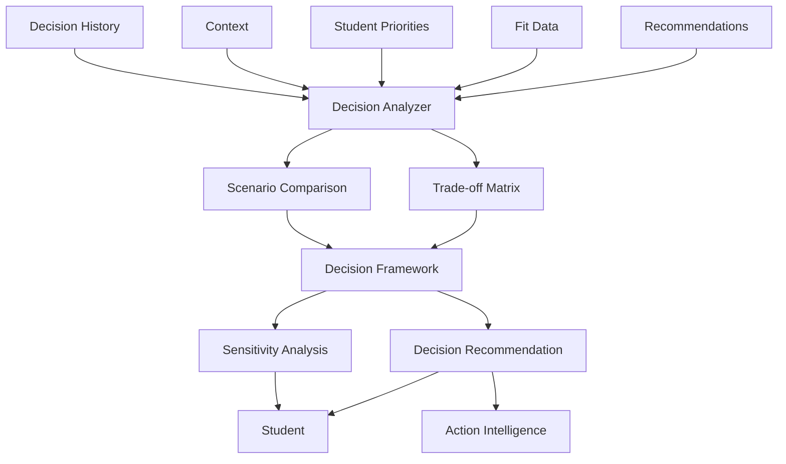

# 13 - Decision Intelligence

## Purpose

Decision Intelligence supports students in making career decisions by structuring the decision process, comparing options systematically, evaluating trade-offs, and providing decision frameworks. It transforms recommendations into confident, well-reasoned choices.

## Problem Solved

- Students struggle with career decision paralysis
- No structured way to compare career options
- Trade-offs are not made explicit
- Decisions lack sufficient information
- Post-decision regret is common
- No documentation of decision rationale

## Inputs

| Input | Source | Format | Frequency |
|-------|--------|--------|-----------|
| Recommendations | Recommendation Engine | Recommendation list | On generation |
| Fit Data | Career Fit Engine | Fit scores, breakdowns | On calculation |
| Student Profile | Student Intelligence | Complete profile | On update |
| Context | Context Intelligence | Constraints, opportunities | On change |
| Decision History | Decision Intelligence | Past decisions | Continuous |
| Student Priorities | Student input | Weighted priorities | On input |
| External Factors | Student input | Additional considerations | On input |

## Outputs

| Output | Description | Consumers |
|--------|-------------|-----------|
| Decision Framework | Structured comparison matrix | Student UI |
| Trade-off Analysis | Explicit comparison of options | Student UI |
| Decision Recommendations | Suggested choice with rationale | Student UI |
| Confidence Assessment | Certainty in recommendation | Student UI |
| Decision Record | Documented decision rationale | Outcome Tracking |
| Scenario Comparison | Side-by-side option analysis | Student UI |
| Sensitivity Analysis | How changes affect choice | Student UI |

## Dependencies

| Dependency | Purpose |
|------------|---------|
| Recommendation Engine | Options to evaluate |
| Career Fit Engine | Fit data for comparison |
| Student Intelligence | Student profile |
| Context Intelligence | Constraint awareness |
| Utility Intelligence | Value calculations |
| India Intelligence | India-specific factors |

## Consumers

| Consumer | Usage |
|----------|-------|
| Student UI | Decision support interface |
| Utility Intelligence | Value-weighted comparisons |
| Optionality Intelligence | Option preservation analysis |
| Regret Intelligence | Regret minimization guidance |
| Action Intelligence | Post-decision actions |
| Outcome Tracking | Record decisions for validation |

## Data Flow



## Key Interfaces

### Decision API
```typescript
interface DecisionContext {
  studentId: string;
  options: CareerOption[];
  priorities: Priority[];
  constraints: Constraint[];
  timeframe: DecisionTimeframe;
  reversibility: ReversibilityLevel;
}

interface DecisionAnalysis {
  options: OptionAnalysis[];
  tradeOffs: TradeOff[];
  recommendation?: DecisionRecommendation;
  confidence: number;
  sensitivities: Sensitivity[];
  risks: RiskAssessment[];
}

interface DecisionRecommendation {
  option: CareerOption;
  rationale: string;
  keyFactors: FactorWeight[];
  confidence: number;
  caveats: string[];
}

interface DecisionIntelligenceService {
  analyze(context: DecisionContext): Promise<DecisionAnalysis>;
  compare(options: CareerOption[], criteria: Criteria[]): Promise<ComparisonMatrix>;
  recommend(context: DecisionContext): Promise<DecisionRecommendation>;
  recordDecision(studentId: string, decision: DecisionRecord): Promise<void>;
  getDecisionHistory(studentId: string): Promise<DecisionRecord[]>;
  assessConfidence(analysis: DecisionAnalysis): Promise<ConfidenceScore>;
}
```

## Key Engines

| Engine | Purpose | Status |
|--------|---------|--------|
| Trade-off Analyzer | Identify and quantify trade-offs | 📋 Planned |
| Comparison Framework | Structure multi-criteria comparison | 📋 Planned |
| Recommendation Generator | Suggest optimal choice | 📋 Planned |
| Sensitivity Analyzer | Test decision robustness | 📋 Planned |
| Risk Assessor | Evaluate decision risks | 📋 Planned |
| Confidence Calculator | Assess certainty | 📋 Planned |
| History Analyzer | Learn from past decisions | 📋 Planned |

## Decision Frameworks

### Multi-Criteria Decision Analysis (MCDA)

| Criterion | Weight | How Measured |
|-----------|--------|--------------|
| Fit Score | 25% | Career Fit Engine |
| Salary Potential | 15% | Career Intelligence |
| Growth Prospects | 15% | Market data |
| Interest Alignment | 15% | Student input |
| Feasibility | 15% | Context Intelligence |
| Risk Level | 10% | Risk assessment |
| Optionality | 5% | Optionality Intelligence |

### Decision Types

| Type | Description | Approach |
|------|-------------|----------|
| **Binary** | Yes/no to specific career | Pros/cons analysis |
| **Selection** | Choose one from many | MCDA ranking |
| **Sequencing** | Order of career moves | Path optimization |
| **Timing** | When to make move | Window analysis |
| **Pivot** | Change direction | Regret minimization |

## Current Status

| Component | Status | Notes |
|-----------|--------|-------|
| Decision Model | 📋 Planned | Framework defined |
| Comparison Framework | 📋 Planned | MCDA implementation |
| Trade-off Analysis | 📋 Planned | Q4 2026 |
| Recommendation Logic | 📋 Planned | Rule-based then ML |
| Sensitivity Analysis | 📋 Planned | Monte Carlo simulation |
| Decision Recording | 📋 Planned | Audit trail |

## Future Improvements

1. **Conversational Decision Support**: Chat-based decision help
2. **Group Decisions**: Family/counselor involvement
3. **Decision Journals**: Long-term decision tracking
4. **Decision Patterns**: Learn decision-making styles
5. **Second Opinion**: Compare with peer decisions

## Audit Findings

| Date | Finding | Severity | Status |
|------|---------|----------|--------|
| 2026-06-02 | Need decision quality metrics | High | Open |
| 2026-06-02 | No framework for family-influenced decisions | Medium | Open |

## Risks

| Risk | Impact | Likelihood | Mitigation |
|------|--------|------------|------------|
| Analysis paralysis | Medium | High | Simplify, recommend decisively |
| Overconfidence | Medium | Medium | Uncertainty quantification |
| Bias reinforcement | High | Medium | Diverse perspectives, challenges |
| Wrong recommendation | High | Low | Confidence thresholds, human review |
