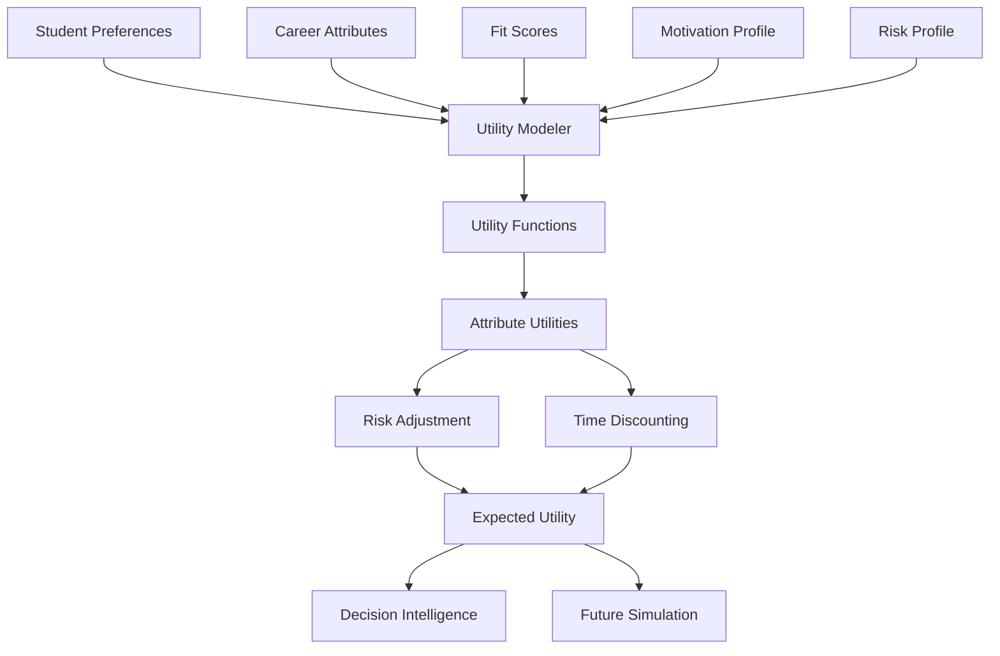

# 14 - Utility Intelligence

## Purpose

Utility Intelligence models the expected value or utility that a student would derive from different career paths. It quantifies subjective preferences into comparable utility scores, enabling objective comparison of diverse career options with different risk and reward profiles.

## Problem Solved

- Students can't compare careers with different attributes
- No systematic way to value trade-offs
- Risk tolerance is not quantified
- Long-term vs. short-term preferences are unbalanced
- Different career dimensions are not commensurable

## Inputs

| Input | Source | Format | Frequency |
|-------|--------|--------|-----------|
| Student Preferences | Student Intelligence | Preference weights | On update |
| Career Attributes | Career Intelligence | Career data | On update |
| Fit Scores | Career Fit Engine | Compatibility scores | On calculation |
| Motivation Profile | Motivation Intelligence | Motivation scores | On analysis |
| Context | Context Intelligence | Constraints, resources | On change |
| Risk Profile | Assessment / Student input | Risk tolerance | On assessment |
| Time Preferences | Student input | Discount rate | On input |
| Market Data | Career Intelligence | Probabilistic outcomes | On update |

## Outputs

| Output | Description | Consumers |
|--------|-------------|-----------|
| Utility Scores | Normalized value per career | Decision Intelligence |
| Utility Curves | Value functions for attributes | Decision Intelligence |
| Risk-Adjusted Utility | Expected utility accounting for risk | Decision Intelligence |
| Time-Discounted Utility | Present value of future utility | Future Simulation |
| Trade-off Rates | Marginal rates of substitution | Decision Intelligence |
| Preference Elicitation | Inferred preferences from choices | Analytics |

## Dependencies

| Dependency | Purpose |
|------------|---------|
| Student Intelligence | Preference data |
| Career Intelligence | Career attributes |
| Career Fit Engine | Fit-based utility components |
| Motivation Intelligence | Motivation-based utility |
| Context Intelligence | Constraint adjustments |
| Decision Intelligence | Decision context |

## Consumers

| Consumer | Usage |
|----------|-------|
| Decision Intelligence | Utility-weighted comparisons |
| Future Simulation | Expected utility over paths |
| Optionality Intelligence | Option value calculation |
| Regret Intelligence | Regret-weighted utility |
| Recommendation Engine | Utility-based ranking |

## Data Flow



## Key Interfaces

### Utility API
```typescript
interface UtilityProfile {
  studentId: string;
  valueFunctions: Map<Attribute, ValueFunction>;
  riskProfile: RiskProfile;
  timePreference: TimePreference;
  tradeOffRates: Map<AttributePair, Rate>;
  derivedAt: Date;
}

interface UtilityCalculation {
  careerId: string;
  baseUtility: number;
  riskAdjustedUtility: number;
  timeDiscountedUtility: number;
  components: UtilityComponent[];
  confidence: number;
}

interface ValueFunction {
  attribute: Attribute;
  type: FunctionType;
  parameters: FunctionParameters;
  curve: Point[];
}

interface UtilityIntelligenceService {
  buildProfile(studentId: string): Promise<UtilityProfile>;
  calculateUtility(careerId: string, profile: UtilityProfile): Promise<UtilityCalculation>;
  compareUtilities(careers: string[], profile: UtilityProfile): Promise<UtilityComparison>;
  elicitPreferences(studentId: string, choices: Choice[]): Promise<PreferenceUpdate>;
  getTradeOffRate(attributeA: Attribute, attributeB: Attribute, profile: UtilityProfile): Promise<Rate>;
}
```

## Key Engines

| Engine | Purpose | Status |
|--------|---------|--------|
| Value Function Builder | Construct attribute value functions | 📋 Planned |
| Preference Elicitor | Infer preferences from behavior | 📋 Planned |
| Risk Adjuster | Apply risk preferences | 📋 Planned |
| Time Discounter | Apply time preferences | 📋 Planned |
| Utility Aggregator | Combine component utilities | 📋 Planned |
| Trade-off Calculator | Compute marginal rates | 📋 Planned |

## Utility Components

| Component | Weight | Description |
|-----------|--------|-------------|
| **Income Utility** | 25% | Salary and earning potential |
| **Growth Utility** | 20% | Learning and advancement |
| **Fit Utility** | 20% | Personal-career compatibility |
| **Security Utility** | 15% | Stability and predictability |
| **Status Utility** | 10% | Prestige and recognition |
| **Autonomy Utility** | 10% | Independence and control |

## Risk Profiles

| Profile | Description | Risk Adjustment |
|---------|-------------|-----------------|
| **Risk Averse** | Prefer certainty | Heavy penalty for variance |
| **Risk Neutral** | Indifferent to risk | No adjustment |
| **Risk Seeking** | Prefer uncertainty | Bonus for high-variance options |
| **S-shaped** | Risk averse for gains, seeking for losses | Prospect theory model |

## Current Status

| Component | Status | Notes |
|-----------|--------|-------|
| Utility Model | 📋 Planned | Framework defined |
| Value Functions | 📋 Planned | Q4 2026 |
| Preference Elicitation | 📋 Planned | Choice-based conjoint |
| Risk Modeling | 📋 Planned | Prospect theory |
| Time Discounting | 📋 Planned | Hyperbolic model |
| Calibration | 📋 Planned | Validation studies |

## Future Improvements

1. **Adaptive Utility**: Update based on life changes
2. **Social Utility**: Incorporate social preferences
3. **Experience Utility**: Predicted vs. experienced utility
4. **Multi-Attribute Models**: More granular attributes
5. **Cultural Utility**: India-specific utility functions

## Audit Findings

| Date | Finding | Severity | Status |
|------|---------|----------|--------|
| 2026-06-02 | Utility weights need empirical validation | High | Open |
| 2026-06-02 | Risk profile assessment not validated | Medium | Open |

## Risks

| Risk | Impact | Likelihood | Mitigation |
|------|--------|------------|------------|
| Preference misrepresentation | High | Medium | Multiple elicitation methods |
| Changing preferences | Medium | High | Continuous updating |
| Cultural bias | Medium | Medium | India-specific research |
| Computational complexity | Low | Medium | Approximation methods |
