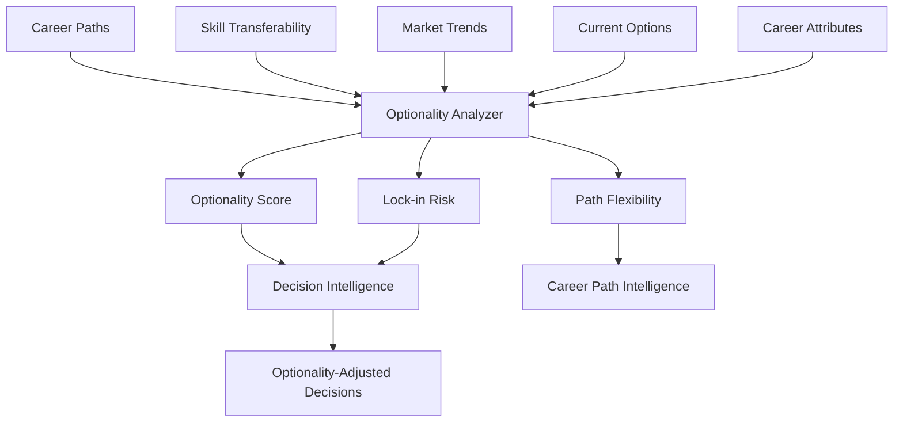

# 15 - Optionality Intelligence

## Purpose

Optionality Intelligence evaluates how well different career choices preserve or create future options. It ensures students don't prematurely close doors and can pivot when needed, maximizing strategic flexibility throughout their career journey.

## Problem Solved

- Students make early commitments without considering future flexibility
- No systematic way to value option preservation
- Career paths that limit future choices go unflagged
- The value of generalist skills is underestimated
- Irreversible decisions are made without adequate consideration

## Inputs

| Input | Source | Format | Frequency |
|-------|--------|--------|-----------|
| Career Paths | Career Path Intelligence | Path options | On calculation |
| Skill Transferability | Career Taxonomy | Skill mappings | On update |
| Market Trends | Career Intelligence | Trend data | On update |
| Student Age/Stage | Student Intelligence | Demographics | On update |
| Current Option Set | Current state | Available options | Continuous |
| Career Attributes | Career Intelligence | Career data | On update |
| Network Position | Student Intelligence | Connection data | On update |

## Outputs

| Output | Description | Consumers |
|--------|-------------|-----------|
| Optionality Score | How many options are preserved | Decision Intelligence |
| Path Flexibility | Ease of pivoting from path | Career Path Intelligence |
| Lock-in Risk | Risk of being stuck | Decision Intelligence |
| Option Value | Expected value of preserved options | Utility Intelligence |
| Strategic Positions | Careers that maximize optionality | Recommendation Engine |
| Reversibility Assessment | How reversible is a decision | Decision Intelligence |

## Dependencies

| Dependency | Purpose |
|------------|---------|
| Career Path Intelligence | Path and transition data |
| Career Taxonomy | Skill transferability |
| Career Intelligence | Career attributes |
| Decision Intelligence | Decision context |
| Utility Intelligence | Option value calculation |

## Consumers

| Consumer | Usage |
|----------|-------|
| Decision Intelligence | Factor optionality into decisions |
| Future Simulation | Model option evolution |
| Career Path Intelligence | Design flexible paths |
| Recommendation Engine | Recommend option-preserving careers |
| Regret Intelligence | Assess regret of closed options |

## Data Flow



## Key Interfaces

### Optionality API
```typescript
interface OptionalityProfile {
  studentId: string;
  currentOptions: CareerOption[];
  optionalityScore: number;
  flexibilityByCareer: Map<string, FlexibilityScore>;
  reversibleDecisions: Decision[];
  irreversibleDecisions: Decision[];
  strategicPositions: Career[];
  calculatedAt: Date;
}

interface FlexibilityScore {
  careerId: string;
  pivotOptions: number;
  transferableSkills: number;
  networkValue: number;
  credentialValue: number;
  reversibility: ReversibilityScore;
}

interface OptionValue {
  option: CareerOption;
  probability: number;
  expectedValue: number;
  exerciseConditions: Condition[];
}

interface OptionalityIntelligenceService {
  assessOptionality(studentId: string): Promise<OptionalityProfile>;
  calculateFlexibility(careerId: string): Promise<FlexibilityScore>;
  evaluateOptionValue(option: CareerOption, context: Context): Promise<OptionValue>;
  identifyStrategicPositions(studentId: string): Promise<Career[]>;
  assessLockInRisk(path: CareerPath): Promise<LockInAssessment>;
  suggestOptionPreservingMoves(studentId: string): Promise<Recommendation[]>;
}
```

## Key Engines

| Engine | Purpose | Status |
|--------|---------|--------|
| Optionality Calculator | Compute optionality scores | 📋 Planned |
| Flexibility Assessor | Evaluate path flexibility | 📋 Planned |
| Transferability Analyzer | Map skill transferability | 📋 Planned |
| Option Valuator | Real options valuation | 📋 Planned |
| Lock-in Detector | Identify irreversible decisions | 📋 Planned |
| Strategic Position Finder | Find option-maximizing careers | 📋 Planned |

## Optionality Factors

| Factor | Description | Impact on Optionality |
|--------|-------------|----------------------|
| **Skill Transferability** | Skills useful in other careers | High |
| **Network Breadth** | Connections across industries | High |
| **Credential Value** | Recognizable qualifications | Medium |
| **Domain Generality** | Applicable to many domains | High |
| **Experience Versatility** | Varied experience base | Medium |
| **Reversibility** | Can undo decision | Critical |
| **Age/Stage** | Time to recover from mistakes | Context-dependent |
| **Market Demand** | Future demand for skills | High |

## Optionality Strategies

| Strategy | Description | Example Careers |
|----------|-------------|-----------------|
| **T-shaped Skills** | Deep expertise + broad knowledge | Product Manager |
| **Platform Careers** | Enable multiple paths | Consulting, Investment Banking |
| **Credential Building** | Acquire transferable credentials | MBA, certifications |
| **Network Expansion** | Build cross-industry relationships | Cross-functional roles |
| **Reversible Moves** | Try before committing | Internships, freelance |
| **Option Stacking** | Multiple small bets | Side projects, learning |

## Current Status

| Component | Status | Notes |
|-----------|--------|-------|
| Optionality Model | 📋 Planned | Framework defined |
| Transferability Matrix | 📋 Planned | Skill mapping needed |
| Flexibility Scoring | 📋 Planned | Q4 2026 |
| Real Options Valuation | 📋 Planned | Financial modeling |
| Lock-in Detection | 📋 Planned | Rule-based initially |
| Strategic Position ID | 📋 Planned | Optimization algorithm |

## Future Improvements

1. **Dynamic Optionality**: Track optionality over time
2. **Option Exercise Modeling**: When to pivot vs. persist
3. **Compounding Options**: How options build on each other
4. **Competitive Optionality**: Optionality relative to peers
5. **Regret-Adjusted Optionality**: Option value with regret

## Audit Findings

| Date | Finding | Severity | Status |
|------|---------|----------|--------|
| 2026-06-02 | Optionality metrics need definition | High | Open |
| 2026-06-02 | No validation data for optionality value | Medium | Open |

## Risks

| Risk | Impact | Likelihood | Mitigation |
|------|--------|------------|------------|
| Overvaluing options | Medium | Medium | Balance with commitment value |
| Underestimating commitment | Medium | Medium | Clear lock-in communication |
| Analysis paralysis | Medium | High | Suggest decisive actions |
| Ignoring option decay | Medium | Medium | Time-sensitive optionality |
