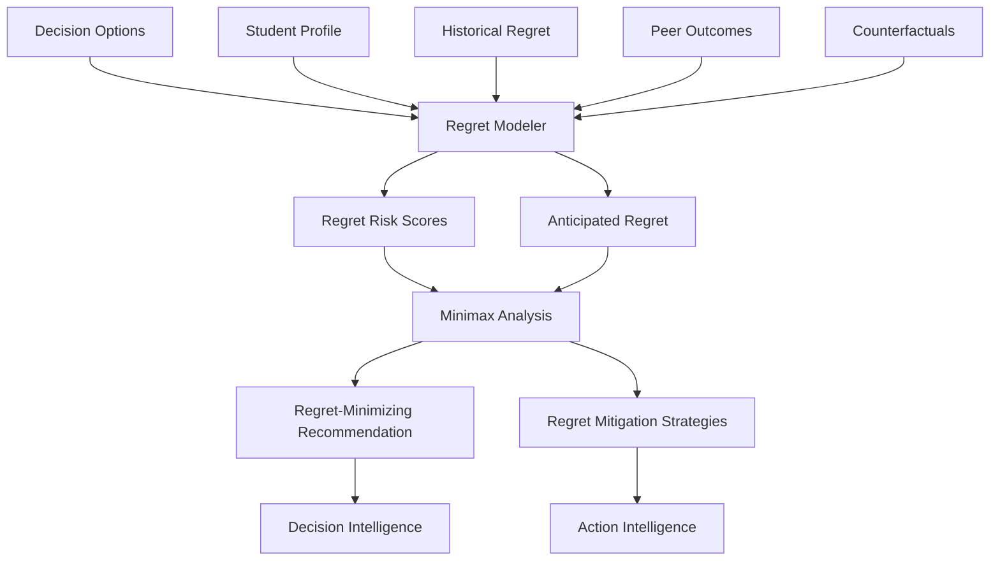

# 16 - Regret Intelligence

## Purpose

Regret Intelligence anticipates and minimizes future regret by modeling how students might feel about decisions in hindsight. It helps students consider not just what seems best now, but what they will wish they had done when looking back.

## Problem Solved

- Students make decisions they later regret
- Short-term comfort leads to long-term regret
- No systematic way to anticipate future regret
- "What if" thoughts persist after decisions
- Fear of missing out (FOMO) drives bad choices

## Inputs

| Input | Source | Format | Frequency |
|-------|--------|--------|-----------|
| Decision Options | Decision Intelligence | Options under consideration | On decision |
| Student Profile | Student Intelligence | Preferences, values | On update |
| Historical Regret Data | Outcome Tracking | Past student outcomes | Continuous |
| Career Trajectories | Career Intelligence | Long-term path data | On update |
| Peer Outcomes | Analytics | Similar student results | Periodic |
| Counterfactual Scenarios | Future Simulation | Alternative paths | On simulation |
| Student Fears | Student input | Expressed concerns | On input |

## Outputs

| Output | Description | Consumers |
|--------|-------------|-----------|
| Regret Risk Score | Probability of future regret | Decision Intelligence |
| Anticipated Regret | Expected regret per option | Decision Intelligence |
| Minimax Recommendation | Option minimizing maximum regret | Decision Intelligence |
| Regret Drivers | Key factors that cause regret | Action Intelligence |
| Counterfactual Analysis | "What if" scenario evaluation | Student UI |
| Regret Mitigation Strategies | How to reduce regret risk | Action Intelligence |

## Dependencies

| Dependency | Purpose |
|------------|---------|
| Decision Intelligence | Decision context |
| Future Simulation | Counterfactual modeling |
| Outcome Tracking | Historical regret data |
| Student Intelligence | Student profile |
| Career Intelligence | Career trajectory data |
| Analytics | Peer outcome patterns |

## Consumers

| Consumer | Usage |
|----------|-------|
| Decision Intelligence | Regret-minimizing recommendations |
| Future Simulation | Model regret in scenarios |
| Action Intelligence | Suggest regret-reducing actions |
| Student UI | Display regret analysis |
| Outcome Tracking | Validate regret predictions |

## Data Flow



## Key Interfaces

### Regret API
```typescript
interface RegretAnalysis {
  decisionId: string;
  options: OptionRegretProfile[];
  minimaxRecommendation: Option;
  expectedUtilityRecommendation: Option;
  regretDrivers: RegretDriver[];
  mitigationStrategies: MitigationStrategy[];
  confidence: number;
}

interface OptionRegretProfile {
  option: Option;
  anticipatedRegret: number;
  regretScenarios: RegretScenario[];
  regretProbability: number;
  regretMagnitude: number;
}

interface RegretScenario {
  description: string;
  probability: number;
  counterfactual: Option;
  regretValue: number;
}

interface RegretIntelligenceService {
  analyzeRegret(decision: DecisionContext): Promise<RegretAnalysis>;
  calculateAnticipatedRegret(option: Option, alternatives: Option[]): Promise<number>;
  identifyRegretDrivers(studentId: string): Promise<RegretDriver[]>;
  getMinimaxRecommendation(options: Option[]): Promise<Option>;
  suggestMitigationStrategies(regret: RegretAnalysis): Promise<MitigationStrategy[]>;
  validateRegretPrediction(predicted: RegretPrediction, actual: Outcome): Promise<ValidationResult>;
}
```

## Key Engines

| Engine | Purpose | Status |
|--------|---------|--------|
| Regret Modeler | Model anticipated regret | 📋 Planned |
| Scenario Generator | Create counterfactual scenarios | 📋 Planned |
| Minimax Calculator | Find regret-minimizing option | 📋 Planned |
| Driver Identifier | Identify regret causes | 📋 Planned |
| Mitigation Suggester | Recommend regret-reducing actions | 📋 Planned |
| Validation Engine | Check regret predictions | 📋 Planned |

## Common Regret Patterns

| Pattern | Description | Prevention Strategy |
|---------|-------------|---------------------|
| **Path Not Taken** | Regret for unchosen option | Document reasoning, preserve options |
| **Timing Regret** | Acting too early or late | Time-based decision frameworks |
| **Capability Regret** | Not developing enough skills | Continuous skill investment |
| **Opportunity Regret** | Missing opportunities | Alert systems, regular reviews |
| **Relationship Regret** | Neglecting relationships | Connection maintenance strategies |
| **Security Regret** | Taking too much/little risk | Risk calibration, diversification |

## Regret Types

| Type | Source | Modeling Approach |
|------|--------|-------------------|
| **Action Regret** | Regret for what was done | Counterfactual simulation |
| **Inaction Regret** | Regret for what wasn't done | Missed opportunity modeling |
| **Process Regret** | Regret about how decision was made | Decision quality assessment |
| **Outcome Regret** | Regret about results | Outcome distribution analysis |
| **Social Regret** | Regret about social consequences | Social comparison modeling |

## Current Status

| Component | Status | Notes |
|-----------|--------|-------|
| Regret Model | 📋 Planned | Framework defined |
| Scenario Generation | 📋 Planned | Monte Carlo simulation |
| Minimax Algorithm | 📋 Planned | Decision theory |
| Driver Identification | 📋 Planned | Pattern analysis |
| Historical Data | 📋 Planned | Outcome tracking needed |
| Mitigation Strategies | 📋 Planned | Intervention design |

## Future Improvements

1. **Personal Regret Models**: Individual regret patterns
2. **Cultural Regret**: India-specific regret factors
3. **Real-Time Regret Alerts**: Monitor for regret risk
4. **Regret Journaling**: Track and learn from actual regret
5. **Collective Regret**: Community-level regret patterns

## Audit Findings

| Date | Finding | Severity | Status |
|------|---------|----------|--------|
| 2026-06-02 | Regret model needs empirical validation | High | Open |
| 2026-06-02 | No India-specific regret research | Medium | Open |

## Risks

| Risk | Impact | Likelihood | Mitigation |
|------|--------|------------|------------|
| Over-weighting regret | Medium | Medium | Balance with opportunity |
| Wrong regret prediction | High | Medium | Validation, confidence intervals |
| Paralysis from regret fear | Medium | Medium | Encourage decisiveness |
| Cultural variation | Medium | Medium | Local research |
