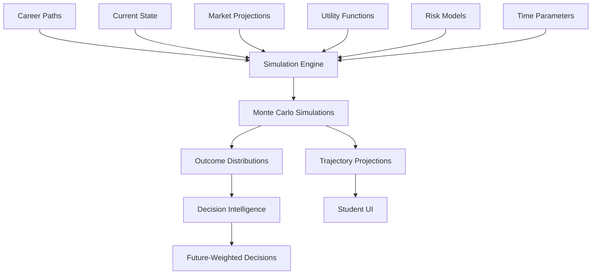

# 17 - Future Simulation

## Purpose

Future Simulation models potential career trajectories over time, projecting how different choices today lead to different futures. It enables students to visualize and compare long-term outcomes, understanding the compounding effects of their decisions.

## Problem Solved

- Students can't visualize long-term consequences
- Short-term thinking dominates career decisions
- No way to model "what if" scenarios
- Compounding effects of choices are invisible
- Uncertainty about the future isn't quantified

## Inputs

| Input | Source | Format | Frequency |
|-------|--------|--------|-----------|
| Career Paths | Career Path Intelligence | Path data | On calculation |
| Current State | Student Intelligence | Student profile | On update |
| Decision Options | Decision Intelligence | Choices | On decision |
| Market Projections | Career Intelligence | Forecast data | On update |
| Utility Functions | Utility Intelligence | Value models | On update |
| Risk Models | Various | Probabilistic models | On update |
| Time Parameters | Simulation config | Time horizon, steps | Per simulation |

## Outputs

| Output | Description | Consumers |
|--------|-------------|-----------|
| Trajectory Projections | Probabilistic future paths | Decision Intelligence |
| Outcome Distributions | Range of possible outcomes | Decision Intelligence |
| Sensitivity Analysis | Which factors matter most | Decision Intelligence |
| Scenario Comparisons | Side-by-side future views | Student UI |
| Expected Timeline | Most likely path | Career Path Intelligence |
| Confidence Intervals | Uncertainty bounds | Decision Intelligence |

## Dependencies

| Dependency | Purpose |
|------------|---------|
| Career Path Intelligence | Path and transition data |
| Career Intelligence | Career trajectory data |
| Utility Intelligence | Value projections |
| Decision Intelligence | Decision context |
| Regret Intelligence | Regret modeling |
| Optionality Intelligence | Option evolution |
| Context Intelligence | Constraint evolution |

## Consumers

| Consumer | Usage |
|----------|-------|
| Decision Intelligence | Compare futures of options |
| Career Path Intelligence | Plan optimal paths |
| Student UI | Visualize future scenarios |
| Regret Intelligence | Regret in different futures |
| Optionality Intelligence | Option evolution over time |

## Data Flow



## Key Interfaces

### Future Simulation API
```typescript
interface SimulationRequest {
  studentId: string;
  scenarios: Scenario[];
  timeHorizon: number;
  timeSteps: TimeStep[];
  iterations: number;
  variables: Variable[];
}

interface SimulationResult {
  scenarios: ScenarioResult[];
  comparisons: ScenarioComparison[];
  sensitivities: SensitivityAnalysis;
  recommendations: SimulationRecommendation[];
  confidence: number;
}

interface ScenarioResult {
  scenario: Scenario;
  outcomeDistribution: Distribution;
  trajectorySamples: Trajectory[];
  milestoneProbabilities: Map<Milestone, number>;
  expectedUtility: number;
}

interface FutureSimulationService {
  runSimulation(request: SimulationRequest): Promise<SimulationResult>;
  compareScenarios(scenarios: Scenario[], horizon: number): Promise<ScenarioComparison[]>;
  projectTrajectory(studentId: string, path: CareerPath): Promise<TrajectoryProjection>;
  analyzeSensitivity(scenario: Scenario, variable: Variable): Promise<SensitivityResult>;
  getConfidenceInterval(result: SimulationResult, confidence: number): Promise<Interval>;
}
```

## Key Engines

| Engine | Purpose | Status |
|--------|---------|--------|
| Monte Carlo Simulator | Run probabilistic simulations | 📋 Planned |
| Trajectory Projector | Model career path evolution | 📋 Planned |
| Outcome Modeler | Calculate result distributions | 📋 Planned |
| Sensitivity Analyzer | Identify key variables | 📋 Planned |
| Scenario Comparer | Compare alternative futures | 📋 Planned |
| Visualization Engine | Prepare data for display | 📋 Planned |

## Simulation Scenarios

| Scenario Type | Description | Use Case |
|---------------|-------------|----------|
| **Base Case** | Most likely path | Default projection |
| **Optimistic** | Best-case assumptions | Aspirational planning |
| **Pessimistic** | Worst-case assumptions | Risk assessment |
| **Comparison** | Option A vs. Option B | Decision making |
| **Pivot** | Mid-course change | Contingency planning |
| **Trend** | Industry trend impact | Market awareness |

## Simulation Variables

| Variable | Distribution | Data Source |
|----------|--------------|-------------|
| **Salary Growth** | Lognormal | Historical data |
| **Promotion Rate** | Poisson | Company data |
| **Industry Growth** | Normal | Market research |
| **Skill Depreciation** | Exponential | Trend analysis |
| **Network Value** | Power law | Network analysis |
| **Option Value** | Real options model | Financial modeling |

## Current Status

| Component | Status | Notes |
|-----------|--------|-------|
| Simulation Framework | 📋 Planned | Architecture defined |
| Monte Carlo Engine | 📋 Planned | Q1 2027 |
| Trajectory Models | 📋 Planned | Path modeling needed |
| Outcome Distributions | 📋 Planned | Statistical modeling |
| Sensitivity Analysis | 📋 Planned | Variable impact |
| Visualization | 📋 Planned | UI integration |

## Future Improvements

1. **Real-Time Simulation**: Interactive scenario exploration
2. **Collective Simulation**: Aggregate student futures
3. **Market Scenario Library**: Pre-built market scenarios
4. **Personal Shock Modeling**: Individual life events
5. **Adaptive Simulation**: Learn from actual outcomes

## Audit Findings

| Date | Finding | Severity | Status |
|------|---------|----------|--------|
| 2026-06-02 | Simulation accuracy needs validation | High | Open |
| 2026-06-02 | Computational scaling for many students | Medium | Open |

## Risks

| Risk | Impact | Likelihood | Mitigation |
|------|--------|------------|------------|
| Overconfidence in predictions | High | Medium | Confidence intervals, disclaimers |
| Model error | High | Medium | Validation, ensemble models |
| Computational cost | Medium | Medium | Optimization, caching |
| Misinterpretation | Medium | Medium | Clear communication |
