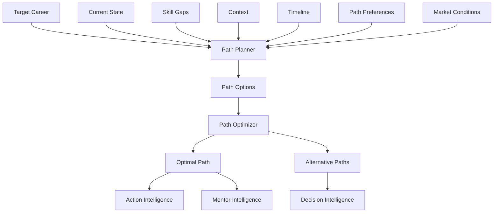

# 18 - Career Path Intelligence

## Purpose

Career Path Intelligence plans and optimizes the sequence of steps needed to reach career goals. It designs personalized career trajectories considering skills, experience, timing, constraints, and strategic objectives.

## Problem Solved

- Students don't know how to reach their career goals
- No systematic path planning from current state to target
- Career transitions seem mysterious and unapproachable
- Path optimization (fastest, safest, highest utility) isn't considered
- Alternative paths to the same goal aren't explored

## Inputs

| Input | Source | Format | Frequency |
|-------|--------|--------|-----------|
| Target Career | Student input / Recommendations | Career selection | On selection |
| Current State | Student Intelligence | Profile, skills | On update |
| Career Requirements | Career Intelligence | Requirements | On update |
| Context | Context Intelligence | Constraints | On change |
| Timeline | Student input | Target dates | On input |
| Path Preferences | Student input | Path priorities | On input |
| Skill Gaps | Career Fit Engine | Gap analysis | On calculation |
| Market Conditions | Career Intelligence | Market data | On update |

## Outputs

| Output | Description | Consumers |
|--------|-------------|-----------|
| Career Path | Step-by-step plan to goal | Action Intelligence |
| Alternative Paths | Multiple route options | Decision Intelligence |
| Milestone Timeline | Key checkpoints | Student UI |
| Skill Development Plan | Skills to acquire | Action Intelligence |
| Resource Requirements | What resources are needed | Context Intelligence |
| Risk Assessment | Path risks and mitigations | Decision Intelligence |
| Path Comparison | Compare alternative paths | Decision Intelligence |

## Dependencies

| Dependency | Purpose |
|------------|---------|
| Career Intelligence | Career data and requirements |
| Career Fit Engine | Gap identification |
| Career Taxonomy | Transition mappings |
| Student Intelligence | Current state |
| Context Intelligence | Constraint awareness |
| India Intelligence | India-specific path considerations |
| Decision Intelligence | Path comparison |
| Future Simulation | Path outcome modeling |

## Consumers

| Consumer | Usage |
|----------|-------|
| Action Intelligence | Generate actions from path |
| Decision Intelligence | Compare path options |
| Student UI | Display career roadmap |
| Mentor Intelligence | Match mentors to path stages |
| Outcome Tracking | Monitor path progress |

## Data Flow



## Key Interfaces

### Career Path API
```typescript
interface CareerPath {
  pathId: string;
  studentId: string;
  targetCareerId: string;
  steps: PathStep[];
  milestones: Milestone[];
  timeline: Timeline;
  resources: ResourceRequirement[];
  risks: Risk[];
  alternatives: AlternativePath[];
  utility: number;
}

interface PathStep {
  stepNumber: number;
  type: StepType;
  description: string;
  duration: Duration;
  skillsAcquired: Skill[];
  prerequisites: Prerequisite[];
  resources: Resource[];
  outcomes: Outcome[];
}

enum StepType {
  EDUCATION = 'EDUCATION',
  CERTIFICATION = 'CERTIFICATION',
  EXPERIENCE = 'EXPERIENCE',
  NETWORKING = 'NETWORKING',
  PROJECT = 'PROJECT',
  TRANSITION = 'TRANSITION'
}

interface CareerPathIntelligenceService {
  planPath(studentId: string, targetCareerId: string): Promise<CareerPath>;
  planPaths(studentId: string, targetCareerId: string, count: number): Promise<CareerPath[]>;
  optimizePath(path: CareerPath, criteria: OptimizationCriteria): Promise<CareerPath>;
  getMilestones(path: CareerPath): Promise<Milestone[]>;
  assessPathFeasibility(path: CareerPath, context: Context): Promise<FeasibilityAssessment>;
  suggestAlternatives(path: CareerPath): Promise<AlternativePath[]>;
  adaptPath(path: CareerPath, change: ChangeEvent): Promise<CareerPath>;
}
```

## Key Engines

| Engine | Purpose | Status |
|--------|---------|--------|
| Path Planner | Generate path options | 📋 Planned |
| Path Optimizer | Find optimal path by criteria | 📋 Planned |
| Gap Analyzer | Identify skill/experience gaps | 📋 Planned |
| Timeline Estimator | Estimate step durations | 📋 Planned |
| Resource Planner | Identify required resources | 📋 Planned |
| Risk Assessor | Evaluate path risks | 📋 Planned |
| Alternative Generator | Create backup paths | 📋 Planned |

## Path Optimization Criteria

| Criteria | Description | Best For |
|----------|-------------|----------|
| **Fastest** | Minimum time to goal | Urgent transitions |
| **Safest** | Minimum risk path | Risk-averse students |
| **Cheapest** | Minimum cost path | Budget-constrained |
| **Highest Utility** | Maximum expected value | Optimization-focused |
| **Most Flexible** | Maximum option preservation | Uncertain students |
| **Most Learning** | Maximum skill development | Growth-focused |

## Path Step Types

| Step Type | Description | Examples |
|-----------|-------------|----------|
| **Education** | Formal learning | Degree, diploma |
| **Certification** | Professional credentials | AWS, PMP, CFA |
| **Experience** | Work experience | Job, internship |
| **Networking** | Relationship building | Events, connections |
| **Project** | Portfolio building | Side projects, open source |
| **Transition** | Career moves | Job change, pivot |

## Current Status

| Component | Status | Notes |
|-----------|--------|-------|
| Path Model | 📋 Planned | Framework defined |
| Planning Algorithm | 📋 Planned | Graph search |
| Optimization Engine | 📋 Planned | Multi-objective |
| Gap Analysis | 📋 Planned | Skill mapping |
| Timeline Estimation | 📋 Planned | Data-driven |
| Alternative Generation | 📋 Planned | Variant paths |

## Future Improvements

1. **Dynamic Path Updates**: Adjust as student progresses
2. **Path Sharing**: See paths of successful peers
3. **Mentor Path Integration**: Learn from mentor experiences
4. **Opportunity Integration**: Incorporate real opportunities
5. **Contingency Planning**: Built-in pivot points

## Audit Findings

| Date | Finding | Severity | Status |
|------|---------|----------|--------|
| 2026-06-02 | Path planning needs validation data | High | Open |
| 2026-06-02 | Timeline estimation requires research | Medium | Open |

## Risks

| Risk | Impact | Likelihood | Mitigation |
|------|--------|------------|------------|
| Plan rigidity | Medium | Medium | Emphasize flexibility, pivots |
| Timeline slippage | Medium | High | Buffer time, checkpoints |
| Resource underestimation | Medium | Medium | Conservative estimates |
| Market changes | High | Medium | Regular plan review |
