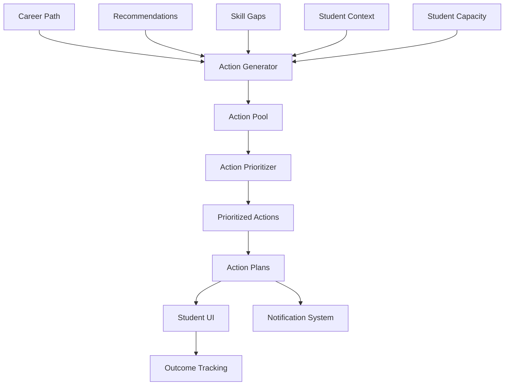

# 19 - Action Intelligence

## Purpose

Action Intelligence translates career insights and plans into concrete, actionable next steps. It breaks down career paths into discrete actions, prioritizes them, and provides execution guidance to move students from planning to doing.

## Problem Solved

- Students know what to do but not how to do it
- Career plans are too abstract to execute
- No prioritization of competing actions
- Students procrastinate on important steps
- Actions aren't tailored to student context
- No tracking of action completion

## Inputs

| Input | Source | Format | Frequency |
|-------|--------|--------|-----------|
| Career Path | Career Path Intelligence | Path steps | On plan |
| Recommendations | Recommendation Engine | Recommendations | On generation |
| Skill Gaps | Career Fit Engine | Gap analysis | On calculation |
| Student Context | Context Intelligence | Constraints | On change |
| Student Capacity | Student Intelligence | Availability | On update |
| Current Actions | Action Tracking | Active actions | Continuous |
| Resource Availability | External | Opportunity data | Periodic |
| Timing Factors | System | Deadlines, windows | Real-time |

## Outputs

| Output | Description | Consumers |
|--------|-------------|-----------|
| Action Items | Specific, actionable tasks | Student UI |
| Prioritized Queue | Ordered action list | Student UI |
| Action Plans | Grouped action sets | Student UI |
| Execution Guidance | How-to instructions | Student UI |
| Progress Tracking | Completion status | Outcome Tracking |
| Next Actions | Immediate next steps | Notifications |
| Reminders | Follow-up prompts | Notification System |

## Dependencies

| Dependency | Purpose |
|------------|---------|
| Career Path Intelligence | Path to decompose |
| Recommendation Engine | Recommendations to action |
| Career Fit Engine | Gap identification |
| Student Intelligence | Student state |
| Context Intelligence | Constraint awareness |
| Mentor Intelligence | Mentor-guided actions |
| India Intelligence | India-specific actions |

## Consumers

| Consumer | Usage |
|----------|-------|
| Student UI | Display action items |
| Notification System | Send reminders |
| Outcome Tracking | Track completion |
| Mentor Intelligence | Mentor-suggested actions |
| Analytics | Track action patterns |

## Data Flow



## Key Interfaces

### Action API
```typescript
interface Action {
  actionId: string;
  studentId: string;
  type: ActionType;
  title: string;
  description: string;
  instructions: string[];
  resources: Resource[];
  estimatedDuration: Duration;
  priority: Priority;
  deadline?: Date;
  dependencies: string[];
  outcomes: Outcome[];
  status: ActionStatus;
}

interface ActionPlan {
  planId: string;
  studentId: string;
  title: string;
  actions: Action[];
  timeline: Timeline;
  category: PlanCategory;
  progress: number;
}

enum ActionType {
  LEARN_SKILL = 'LEARN_SKILL',
  BUILD_NETWORK = 'BUILD_NETWORK',
  GAIN_EXPERIENCE = 'GAIN_EXPERIENCE',
  APPLY_JOB = 'APPLY_JOB',
  PREPARE_EXAM = 'PREPARE_EXAM',
| COMPLETE_COURSE = 'COMPLETE_COURSE',
  CREATE_PORTFOLIO = 'CREATE_PORTFOLIO',
  SEEK_MENTOR = 'SEEK_MENTOR',
  RESEARCH_CAREER = 'RESEARCH_CAREER',
  UPDATE_PROFILE = 'UPDATE_PROFILE'
}

interface ActionIntelligenceService {
  generateActions(context: ActionContext): Promise<Action[]>;
  prioritizeActions(actions: Action[], studentId: string): Promise<Action[]>;
  createActionPlan(actions: Action[], title: string): Promise<ActionPlan>;
  getNextAction(studentId: string): Promise<Action>;
  getActionPlan(studentId: string): Promise<ActionPlan>;
  completeAction(actionId: string): Promise<void>;
  deferAction(actionId: string, reason: string): Promise<void>;
  suggestResources(action: Action): Promise<Resource[]>;
}
```

## Key Engines

| Engine | Purpose | Status |
|--------|---------|--------|
| Action Generator | Create specific actions from plans | 📋 Planned |
| Action Prioritizer | Rank actions by importance | 📋 Planned |
| Plan Assembler | Group actions into plans | 📋 Planned |
| Instruction Generator | Create how-to guidance | 📋 Planned |
| Resource Suggester | Find helpful resources | 📋 Planned |
| Timing Optimizer | Schedule actions optimally | 📋 Planned |
| Progress Tracker | Monitor completion | 📋 Planned |

## Action Categories

| Category | Description | Example Actions |
|----------|-------------|-----------------|
| **Skill Building** | Acquire new capabilities | Take course, practice, certify |
| **Experience** | Gain relevant experience | Internship, project, volunteer |
| **Network** | Build professional relationships | Attend events, connect, coffee chat |
| **Application** | Apply for opportunities | Apply to jobs, programs |
| **Preparation** | Get ready for transitions | Update resume, prepare for interview |
| **Research** | Gather information | Informational interviews, research |
| **Mentorship** | Get guidance | Find mentor, schedule meetings |

## Action Prioritization Factors

| Factor | Weight | Description |
|--------|--------|-------------|
| **Impact** | 30% | How much does this advance the goal |
| **Urgency** | 25% | Time sensitivity |
| **Effort** | 20% | Resource requirements |
| **Dependencies** | 15% | Blocks other actions |
| **Confidence** | 10% | Likelihood of success |

## Current Status

| Component | Status | Notes |
|-----------|--------|-------|
| Action Model | 📋 Planned | Framework defined |
| Action Generation | 📋 Planned | Rule-based first |
| Prioritization Engine | 📋 Planned | Scoring algorithm |
| Plan Assembly | 📋 Planned | Grouping logic |
| Instruction Templates | 📋 Planned | Content creation |
| Progress Tracking | 📋 Planned | Completion logging |

## Future Improvements

1. **Smart Scheduling**: Optimal timing based on student calendar
2. **Micro-Actions**: Very small, low-friction actions
3. **Gamification**: Points, streaks, achievements
4. **Peer Actions**: See what similar students are doing
5. **Adaptive Difficulty**: Adjust based on success rate

## Audit Findings

| Date | Finding | Severity | Status |
|------|---------|----------|--------|
| 2026-06-02 | Action granularity needs definition | Medium | Open |
| 2026-06-02 | India-specific action library needed | Medium | Open |

## Risks

| Risk | Impact | Likelihood | Mitigation |
|------|--------|------------|------------|
| Action overwhelm | Medium | High | Limit concurrent actions |
| Low completion rates | Medium | Medium | Simplify, gamify |
| Wrong actions | High | Medium | Validation, feedback |
| Procrastination | Medium | High | Reminders, accountability |
