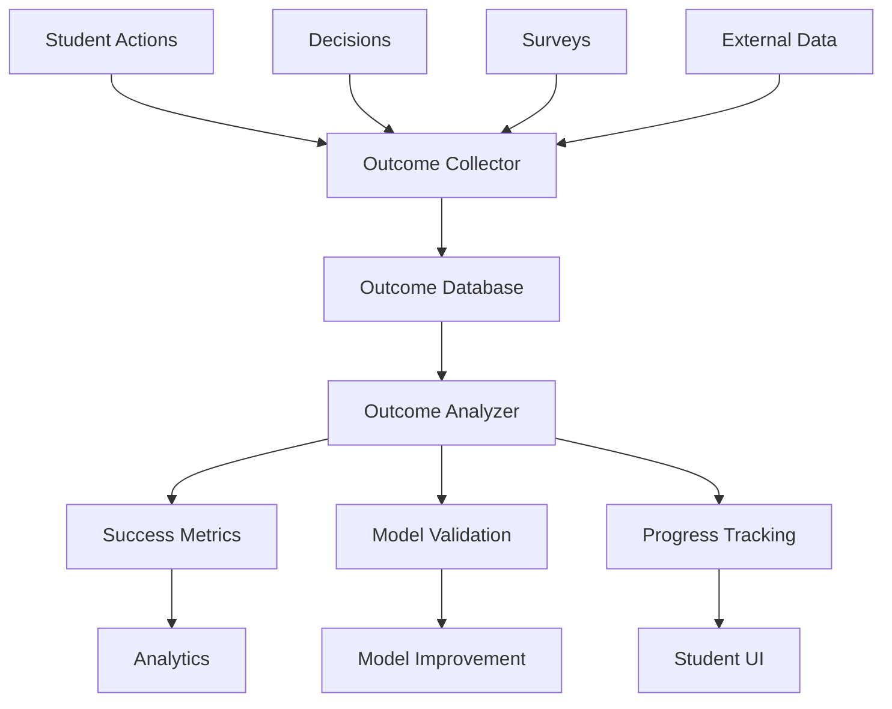

# 20 - Outcome Tracking

## Purpose

Outcome Tracking monitors the real-world results of career decisions and actions, closing the feedback loop for the entire intelligence system. It validates predictions, improves models, and demonstrates value to students and stakeholders.

## Problem Solved

- Career advice effectiveness is unknown
- No feedback loop to improve recommendations
- Students don't see progress toward goals
- System accuracy can't be measured
- Long-term outcomes aren't tracked
- Success stories aren't captured

## Inputs

| Input | Source | Format | Frequency |
|-------|--------|--------|-----------|
| Student Actions | Action Intelligence | Action completions | On completion |
| Career Decisions | Decision Intelligence | Decision records | On decision |
| Milestone Achievements | Student input / System | Milestone data | On achievement |
| Career Transitions | Student input | Job changes | On change |
| Satisfaction Data | Student input | Surveys, ratings | Periodic |
| Salary Data | Student input | Compensation | Periodic |
| External Outcomes | External APIs | Public data | Periodic |
| Follow-up Surveys | Survey system | Structured feedback | Scheduled |

## Outputs

| Output | Description | Consumers |
|--------|-------------|-----------|
| Outcome Metrics | Quantified results | Analytics |
| Success Predictions | Validate system accuracy | Model Improvement |
| Student Progress | Individual progress tracking | Student UI |
| Model Performance | Accuracy metrics | Analytics |
| Cohort Analysis | Group outcome patterns | Product Strategy |
| ROI Calculations | Value delivered | Business Metrics |
| Case Studies | Success stories | Marketing |

## Dependencies

| Dependency | Purpose |
|------------|---------|
| Student Intelligence | Student identification |
| Decision Intelligence | Decision records |
| Action Intelligence | Action tracking |
| Career Intelligence | Career outcome baselines |
| Survey System | Data collection |
| Analytics Platform | Data processing |

## Consumers

| Consumer | Usage |
|----------|-------|
| Career Fit Engine | Validate fit predictions |
| Recommendation Engine | Validate recommendation quality |
| Decision Intelligence | Validate decision support |
| Future Simulation | Validate projections |
| Analytics | Business intelligence |
| Student UI | Progress visualization |
| Product Team | Feature prioritization |

## Data Flow



## Key Interfaces

### Outcome API
```typescript
interface Outcome {
  outcomeId: string;
  studentId: string;
  type: OutcomeType;
  timestamp: Date;
  value: OutcomeValue;
  confidence: number;
  source: OutcomeSource;
  relatedDecision?: string;
  relatedActions: string[];
}

interface OutcomeMetrics {
  studentId: string;
  careerSatisfaction: number;
  salaryProgression: SalaryData[];
  roleProgression: RoleData[];
  skillGrowth: SkillGrowth[];
  goalAchievement: number;
  recommendationAccuracy: number;
}

enum OutcomeType {
  JOB_PLACEMENT = 'JOB_PLACEMENT',
  PROMOTION = 'PROMOTION',
  SKILL_ACQUISITION = 'SKILL_ACQUISITION',
  CERTIFICATION = 'CERTIFICATION',
  NETWORK_GROWTH = 'NETWORK_GROWTH',
  SATISFACTION = 'SATISFACTION',
  SALARY_CHANGE = 'SALARY_CHANGE',
  CAREER_CHANGE = 'CAREER_CHANGE',
  GOAL_ACHIEVEMENT = 'GOAL_ACHIEVEMENT'
}

interface OutcomeTrackingService {
  recordOutcome(outcome: OutcomeInput): Promise<Outcome>;
  getOutcomes(studentId: string): Promise<Outcome[]>;
  getMetrics(studentId: string): Promise<OutcomeMetrics>;
  validatePrediction(prediction: Prediction, outcome: Outcome): Promise<ValidationResult>;
  calculateAccuracy(model: string): Promise<AccuracyMetrics>;
  generateReport(cohort: Cohort): Promise<OutcomeReport>;
}
```

## Key Engines

| Engine | Purpose | Status |
|--------|---------|--------|
| Outcome Collector | Gather outcome data | 📋 Planned |
| Survey Orchestrator | Manage feedback surveys | 📋 Planned |
| Progress Calculator | Compute student progress | 📋 Planned |
| Model Validator | Compare predictions to outcomes | 📋 Planned |
| Cohort Analyzer | Analyze group patterns | 📋 Planned |
| Success Predictor | Predict future outcomes | 📋 Planned |

## Outcome Categories

| Category | Metrics | Tracking Method |
|----------|---------|-----------------|
| **Career Progress** | Job changes, promotions | Self-report + verification |
| **Compensation** | Salary, benefits | Self-report (aggregated) |
| **Satisfaction** | Job satisfaction, fulfillment | Surveys |
| **Skill Growth** | Skills acquired, proficiency | Assessments + self-report |
| **Network** | Connections, relationships | Platform data |
| **Goal Achievement** | Goals met, milestones | Progress tracking |
| **System Value** | Recommendation usefulness | Feedback surveys |

## Success Metrics

| Metric | Definition | Target |
|--------|------------|--------|
| **Recommendation Accuracy** | % of recommendations leading to positive outcomes | >70% |
| **Decision Confidence** | Student-reported confidence increase | +30% |
| **Path Adherence** | % of students following recommended paths | >60% |
| **Goal Achievement Rate** | % achieving stated career goals | >50% |
| **Time to Goal** | Months to reach career objective | <24 months |
| **Satisfaction Score** | Student satisfaction with outcome | >4.0/5.0 |

## Current Status

| Component | Status | Notes |
|-----------|--------|-------|
| Outcome Model | 📋 Planned | Framework defined |
| Data Collection | 📋 Planned | Survey design |
| Progress Tracking | 📋 Planned | Milestone definitions |
| Model Validation | 📋 Planned | Accuracy metrics |
| Cohort Analysis | 📋 Planned | Statistical analysis |
| Reporting | 📋 Planned | Dashboard design |

## Future Improvements

1. **Automated Outcome Detection**: Infer outcomes from external data
2. **Longitudinal Tracking**: 5, 10-year outcome studies
3. **Causal Analysis**: Attribute outcomes to specific interventions
4. **Predictive Success Modeling**: Predict who will succeed
5. **Personalized Progress**: Individual progress baselines

## Audit Findings

| Date | Finding | Severity | Status |
|------|---------|----------|--------|
| 2026-06-02 | Outcome attribution is challenging | High | Open |
| 2026-06-02 | Long-term follow-up infrastructure needed | Medium | Open |

## Risks

| Risk | Impact | Likelihood | Mitigation |
|------|--------|------------|------------|
| Low response rates | High | Medium | Incentives, multiple touchpoints |
| Self-reporting bias | Medium | High | Triangulation, verification |
| Attrition | High | Medium | Long-term engagement strategies |
| Privacy concerns | Medium | Medium | Clear consent, data minimization |
