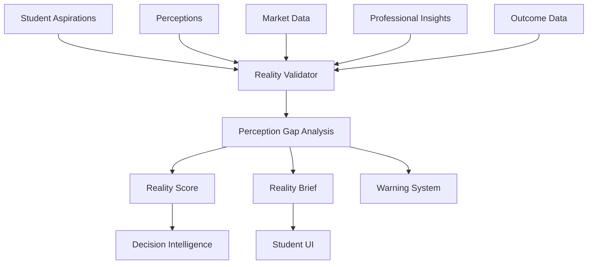

# 21 - Career Reality

## Purpose

Career Reality validates career aspirations against real-world conditions, ensuring students have accurate expectations about careers. It surfaces the gap between perception and reality, preventing disillusionment and poor decisions based on incomplete information.

## Problem Solved

- Students have unrealistic career expectations
- Glamorous careers hide harsh realities
- Day-to-day work differs from job descriptions
- Success stories create survivorship bias
- Students don't understand career trade-offs
- No systematic reality-check mechanism

## Inputs

| Input | Source | Format | Frequency |
|-------|--------|--------|-----------|
| Student Aspirations | Student input | Career interests | On input |
| Career Perceptions | Assessment | Belief inventory | Per assessment |
| Market Data | Career Intelligence | Reality data | On update |
| Professional Insights | Mentors, professionals | First-hand accounts | Continuous |
| Outcome Data | Outcome Tracking | Actual outcomes | Continuous |
| Day-in-Life Data | Content | Real work descriptions | On update |
| Industry Trends | Market research | Trend reports | Periodic |

## Outputs

| Output | Description | Consumers |
|--------|-------------|-----------|
| Reality Score | Accuracy of student perception | Decision Intelligence |
| Perception Gaps | Where expectations differ from reality | Student UI |
| Reality Brief | Honest career description | Student UI |
| Trade-off Analysis | Explicit career trade-offs | Decision Intelligence |
| Success Probability | Realistic odds of success | Decision Intelligence |
| Warning Flags | High-risk career misconceptions | Recommendation Engine |
| Adjustment Suggestions | How to align expectations | Action Intelligence |

## Dependencies

| Dependency | Purpose |
|------------|---------|
| Career Intelligence | Career reality data |
| Student Intelligence | Student perceptions |
| Assessment Intelligence | Perception assessments |
| Outcome Tracking | Real outcome data |
| Mentor Intelligence | Professional perspectives |
| India Intelligence | India-specific realities |

## Consumers

| Consumer | Usage |
|----------|-------|
| Decision Intelligence | Reality-informed decisions |
| Recommendation Engine | Flag unrealistic choices |
| Student UI | Display reality information |
| Action Intelligence | Suggest reality exploration |
| Mentor Intelligence | Match for reality conversations |

## Data Flow



## Key Interfaces

### Career Reality API
```typescript
interface CareerRealityProfile {
  careerId: string;
  dayInLife: DayInLife;
  workEnvironment: WorkEnvironment;
  challenges: Challenge[];
  rewards: Reward[];
  successFactors: SuccessFactor[];
  failureModes: FailureMode[];
  workLifeBalance: WorkLifeBalanceData;
  stressLevels: StressLevel;
  jobSecurity: JobSecurityData;
  entryBarriers: EntryBarrier[];
}

interface RealityCheck {
  studentId: string;
  careerId: string;
  perceptionScore: number;
  gaps: PerceptionGap[];
  realityBrief: string;
  warnings: Warning[];
  tradeOffs: TradeOff[];
  successProbability: number;
  confidence: number;
}

interface PerceptionGap {
  aspect: CareerAspect;
  studentPerception: string;
  reality: string;
  gapSeverity: Severity;
  impact: string;
}

interface CareerRealityService {
  getRealityProfile(careerId: string): Promise<CareerRealityProfile>;
  checkReality(studentId: string, careerId: string): Promise<RealityCheck>;
  identifyGaps(studentId: string, careerId: string): Promise<PerceptionGap[]>;
  calculateSuccessProbability(studentId: string, careerId: string): Promise<number>;
  generateRealityBrief(careerId: string, audience: Audience): Promise<string>;
  getTradeOffs(careerId: string): Promise<TradeOff[]>;
}
```

## Key Engines

| Engine | Purpose | Status |
|--------|---------|--------|
| Reality Profiler | Build career reality profiles | 📋 Planned |
| Perception Analyzer | Analyze student expectations | 📋 Planned |
| Gap Identifier | Find perception-reality gaps | 📋 Planned |
| Warning Generator | Flag unrealistic aspirations | 📋 Planned |
| Trade-off Analyzer | Surface career trade-offs | 📋 Planned |
| Success Modeler | Model realistic success odds | 📋 Planned |

## Reality Dimensions

| Dimension | Description | Data Sources |
|-----------|-------------|--------------|
| **Day-to-Day Work** | Actual daily tasks | Professionals, job descriptions |
| **Work Environment** | Physical and cultural setting | Employee reviews, interviews |
| **Career Trajectory** | Realistic progression paths | Alumni data, LinkedIn |
| **Compensation Reality** | Actual vs. reported salaries | Surveys, salary data |
| **Work-Life Balance** | Hours, flexibility, stress | Employee surveys |
| **Entry Difficulty** | Real barriers to entry | Application data, acceptance rates |
| **Success Factors** | What actually leads to success | High-performer interviews |
| **Failure Modes** | Common reasons for failure | Exit interviews, stories |

## Common Perception Gaps

| Career | Common Misconception | Reality |
|--------|---------------------|---------|
| **Investment Banking** | High salary, prestige | Long hours, high stress, limited seats |
| **Data Science** | Coding all day | Meetings, data cleaning, business context |
| **Entrepreneurship** | Freedom, wealth | Risk, stress, 24/7 work |
| **Medicine** | Helping people, respect | Long training, bureaucracy, burnout |
| **Software Engineering** | Remote work, high pay | Competition, continuous learning, on-call |
| **Civil Services** | Job security, power | Slow growth, transfers, political pressure |

## Current Status

| Component | Status | Notes |
|-----------|--------|-------|
| Reality Model | 📋 Planned | Framework defined |
| Perception Assessment | 📋 Planned | Survey design |
| Gap Analysis | 📋 Planned | Comparison engine |
| Reality Content | 📋 Planned | Content creation |
| Warning System | 📋 Planned | Rule-based alerts |
| Success Modeling | 📋 Planned | Probability estimation |

## Future Improvements

1. **Day-in-Life Simulations**: Interactive career experiences
2. **Reality Videos**: Video content from professionals
3. **Shadow Programs**: Connect with working professionals
4. **Reality Scoring**: Gamify reality alignment
5. **Cohort Reality**: Peer expectation calibration

## Audit Findings

| Date | Finding | Severity | Status |
|------|---------|----------|--------|
| 2026-06-02 | Reality data collection is resource-intensive | Medium | Open |
| 2026-06-02 | Need India-specific reality data | High | Open |

## Risks

| Risk | Impact | Likelihood | Mitigation |
|------|--------|------------|------------|
| Demotivation | Medium | Medium | Balance realism with inspiration |
| Confirmation bias | Medium | Medium | Present multiple perspectives |
| Data staleness | Medium | Medium | Continuous updates |
| Over-correction | Low | Medium | Avoid discouraging ambition |
