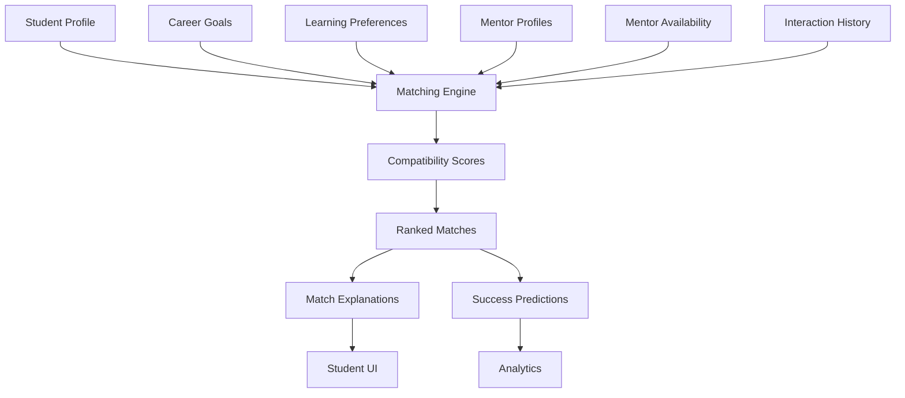

# 22 - Mentor Intelligence

## Purpose

Mentor Intelligence matches students with appropriate mentors based on career goals, context, learning style, and compatibility. It manages the mentor-student relationship lifecycle from matching through ongoing engagement.

## Problem Solved

- Students don't know how to find mentors
- Mentorship matching is often random
- No systematic way to identify compatible mentors
- Mentor-student relationships often fail
- No tracking of mentorship outcomes
- Mentor time is not optimally allocated

## Inputs

| Input | Source | Format | Frequency |
|-------|--------|--------|-----------|
| Student Profile | Student Intelligence | Complete profile | On update |
| Career Goals | Student input | Target careers | On input |
| Learning Preferences | Assessment | Learning style | Per assessment |
| Mentor Profiles | Mentor input | Mentor data | On registration |
| Mentor Availability | Mentor input | Schedule, capacity | On update |
| Interaction History | System | Past mentoring | Continuous |
| Feedback Data | Both parties | Relationship feedback | Periodic |
| Outcome Data | Outcome Tracking | Mentorship results | Continuous |

## Outputs

| Output | Description | Consumers |
|--------|-------------|-----------|
| Mentor Matches | Ranked mentor recommendations | Student UI |
| Match Scores | Compatibility scores | Decision Intelligence |
| Match Explanations | Why this match works | Student UI |
| Relationship Guidance | How to engage mentor | Action Intelligence |
| Session Recommendations | Optimal meeting topics | Student UI |
| Success Predictions | Likelihood of good match | Analytics |
| Mentor Performance | Mentor effectiveness | Quality Control |

## Dependencies

| Dependency | Purpose |
|------------|---------|
| Student Intelligence | Student data for matching |
| Career Intelligence | Career context for matching |
| Archetype Intelligence | Compatibility assessment |
| Context Intelligence | Location, constraints |
| India Intelligence | India-specific mentor pool |
| Outcome Tracking | Validate matches |
| Calendar System | Schedule coordination |

## Consumers

| Consumer | Usage |
|----------|-------|
| Student UI | Display mentor matches |
| Action Intelligence | Mentorship actions |
| Decision Intelligence | Mentor-guided decisions |
| Career Reality | Mentor reality perspectives |
| Analytics | Match quality analysis |
| Notification System | Match alerts |

## Data Flow



## Key Interfaces

### Mentor API
```typescript
interface MentorProfile {
  mentorId: string;
  careers: Career[];
  experience: Experience[];
  expertise: ExpertiseArea[];
  mentoringStyle: MentoringStyle;
  availability: Availability;
  archetype: Archetype;
  location: Location;
  languages: Language[];
  maxMentees: number;
  currentMentees: number;
  ratings: Rating[];
  outcomes: MentorOutcome[];
}

interface MatchResult {
  studentId: string;
  mentorId: string;
  overallScore: number;
  dimensions: MatchDimension[];
  explanation: MatchExplanation;
  successProbability: number;
  recommendedTopics: string[];
}

interface MatchDimension {
  dimension: MatchFactor;
  score: number;
  weight: number;
  reasoning: string;
}

enum MatchFactor {
  CAREER_ALIGNMENT = 'CAREER_ALIGNMENT',
  STYLE_COMPATIBILITY = 'STYLE_COMPATIBILITY',
  AVAILABILITY_MATCH = 'AVAILABILITY_MATCH',
  LOCATION_PROXIMITY = 'LOCATION_PROXIMITY',
  LANGUAGE_MATCH = 'LANGUAGE_MATCH',
| EXPERIENCE_RELEVANCE = 'EXPERIENCE_RELEVANCE',
  CONTEXT_SIMILARITY = 'CONTEXT_SIMILARITY'
}

interface MentorIntelligenceService {
  findMatches(studentId: string, options?: MatchOptions): Promise<MatchResult[]>;
  calculateCompatibility(studentId: string, mentorId: string): Promise<MatchResult>;
  recommendTopics(match: MatchResult): Promise<string[]>;
  suggestEngagementStrategy(match: MatchResult): Promise<EngagementStrategy>;
  trackOutcome(match: MatchResult, outcome: MentorshipOutcome): Promise<void>;
  getMentorPerformance(mentorId: string): Promise<PerformanceMetrics>;
}
```

## Key Engines

| Engine | Purpose | Status |
|--------|---------|--------|
| Matching Engine | Calculate mentor-student compatibility | 📋 Planned |
| Compatibility Scorer | Multi-factor compatibility scoring | 📋 Planned |
| Availability Matcher | Schedule coordination | 📋 Planned |
| Topic Recommender | Suggest discussion topics | 📋 Planned |
| Success Predictor | Predict match success | 📋 Planned |
| Performance Tracker | Monitor mentor effectiveness | 📋 Planned |

## Match Factors

| Factor | Weight | Description |
|--------|--------|-------------|
| **Career Alignment** | 25% | Mentor's career matches student's goal |
| **Style Compatibility** | 20% | Archetype and mentoring style match |
| **Experience Relevance** | 15% | Mentor has relevant experience |
| **Context Similarity** | 15% | Similar background, challenges |
| **Availability Match** | 10% | Compatible schedules |
| **Location Proximity** | 10% | Geographic accessibility |
| **Language Match** | 5% | Common language |

## Mentoring Styles

| Style | Description | Best For |
|-------|-------------|----------|
| **Advisor** | Gives specific advice | Students with clear questions |
| **Coach** | Asks guiding questions | Self-directed students |
| **Connector** | Opens doors, makes introductions | Network-building students |
| **Challenger** | Pushes, sets high standards | High-potential students |
| **Sponsor** | Advocates for advancement | Career climbers |
| **Peer** | Collaborative problem-solving | Similar-level students |

## Current Status

| Component | Status | Notes |
|-----------|--------|-------|
| Matching Model | 📋 Planned | Framework defined |
| Mentor Database | 📋 Planned | Schema ready |
| Compatibility Scoring | 📋 Planned | Algorithm design |
| Topic Recommendations | 📋 Planned | Content mapping |
| Outcome Tracking | 📋 Planned | Feedback system |
| Performance Analytics | 📋 Planned | Quality metrics |

## Future Improvements

1. **Group Mentorship**: Match multiple students with mentors
2. **Peer Mentoring**: Student-to-student mentorship
3. **AI-Assisted Mentorship**: AI support for mentor conversations
4. **Mentor Development**: Train and support mentors
5. **Community Mentorship**: Forum-style mentorship

## Audit Findings

| Date | Finding | Severity | Status |
|------|---------|----------|--------|
| 2026-06-02 | Mentor quality assurance needed | High | Open |
| 2026-06-02 | Need India-specific mentor pool | High | Open |

## Risks

| Risk | Impact | Likelihood | Mitigation |
|------|--------|------------|------------|
| Poor matches | High | Medium | Robust matching, feedback loops |
| Mentor burnout | Medium | Medium | Capacity limits, rotation |
| Scalability | Medium | Medium | AI-assisted, group mentoring |
| Quality variation | High | Medium | Training, ratings, oversight |
