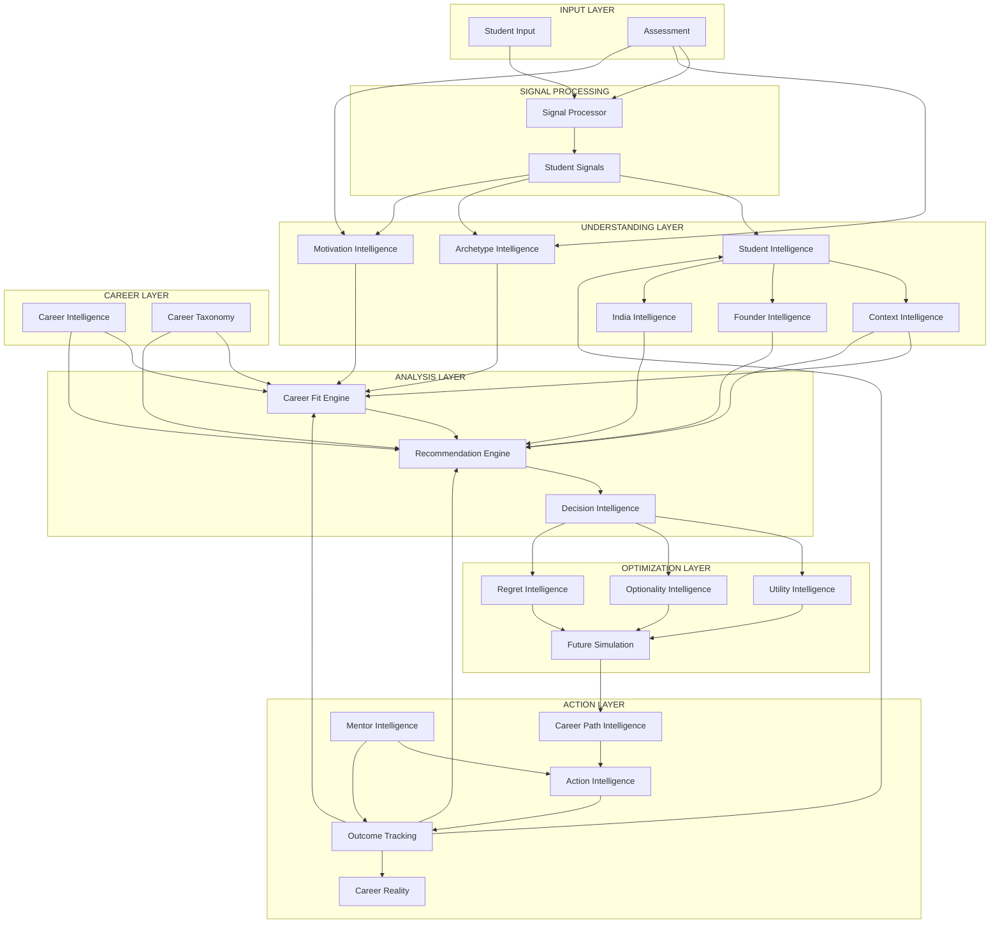

# 23 - Data Flow Map

## Overview

This document maps the complete flow of data through the CareerOS Intelligence Architecture, from initial student input through to action recommendations and outcome tracking.

---

## Complete Data Flow



---

## Detailed Flow by Stage

### Stage 1: Student Input

**Input Sources:**
- Registration data (demographics, education)
- Profile updates (preferences, constraints)
- Behavioral interactions (clicks, time spent, engagement)
- Explicit feedback (ratings, choices, rejections)

**Output:** Raw student data ready for processing

---

### Stage 2: Assessment

**Assessment Types:**
- Psychometric assessments (personality, values)
- Skills assessments (technical, soft skills)
- Interest inventories (career preferences)
- Founder readiness (entrepreneurial traits)
- Context assessments (constraints, resources)

**Output:** Assessment responses, timing data, pattern signals

---

### Stage 3: Signal Processing

**Process:**
```
Raw Input → Validation → Normalization → Signal Extraction
```

**Signal Types:**
- Behavioral signals (engagement patterns)
- Trait signals (extracted characteristics)
- Preference signals (inferred interests)
- Capability signals (demonstrated skills)

**Output:** Normalized, validated signals with metadata

---

### Stage 4: Student Intelligence

**Receives:**
- Signals from processing layer
- Assessment results
- Interaction history
- Outcome feedback

**Produces:**
- Enriched student profile
- Historical timeline
- Segment classification
- Preference vectors

**Flows to:**
- Archetype Intelligence (profile analysis)
- Motivation Intelligence (preference analysis)
- Context Intelligence (situational context)
- Founder Intelligence (entrepreneurial context)
- India Intelligence (India-specific context)

---

### Stage 5: Archetype Intelligence

**Receives:**
- Student profile
- Assessment trait scores
- Behavioral patterns

**Produces:**
- Primary archetype classification
- Archetype vector (multi-dimensional)
- Work style indicators
- Compatibility scores

**Flows to:**
- Career Fit Engine (archetype-career compatibility)
- Recommendation Engine (filter by archetype)
- Mentor Intelligence (mentor matching)

---

### Stage 6: Motivation Intelligence

**Receives:**
- Motivation assessment results
- Value rankings
- Behavioral signals
- Archetype profile

**Produces:**
- Motivation profile (ranked drivers)
- Value hierarchy
- Satisfaction predictors
- Risk factors (demotivators)

**Flows to:**
- Career Fit Engine (motivation alignment)
- Recommendation Engine (prioritize fulfilling careers)
- Decision Intelligence (motivation-based explanations)

---

### Stage 7: Context Intelligence

**Receives:**
- Financial data
- Family obligations
- Geographic constraints
- Educational status
- Timing factors

**Produces:**
- Context profile
- Constraint vector
- Opportunity window
- Flexibility score

**Flows to:**
- Career Fit Engine (context feasibility)
- Recommendation Engine (constraint filtering)
- Decision Intelligence (context-aware support)
- Utility Intelligence (risk tolerance)

---

### Stage 8: Founder Intelligence

**Receives:**
- Founder trait assessment
- Startup ideas
- Resource inventory
- Progress updates

**Produces:**
- Founder readiness score
- Idea viability assessment
- Journey stage
- Resource gaps
- Risk assessment

**Flows to:**
- Recommendation Engine (include entrepreneurship)
- Career Fit Engine (founder fit weighting)
- Career Path Intelligence (founder path planning)

---

### Stage 9: India Intelligence

**Receives:**
- Location data (city, tier)
- Educational background
- Cultural context
- Reservation status
- Economic tier

**Produces:**
- India context profile
- City-tier adjustments
- Cultural constraints
- Market realities
- Opportunity mapping

**Flows to:**
- Career Fit Engine (India-specific adjustments)
- Recommendation Engine (India-specific filtering)
- Career Reality (India market validation)

---

### Stage 10: Career Intelligence

**Data Sources:**
- External market data (salaries, demand)
- Job posting analysis
- Industry research
- Alumni trajectories
- Content team curation

**Produces:**
- Career database
- Market metrics (salary, growth, demand)
- Trajectory maps
- Requirement profiles
- Related career mappings

**Flows to:**
- Career Fit Engine (career requirements)
- Career Taxonomy (classification data)
- Recommendation Engine (career universe)
- Future Simulation (trajectory data)

---

### Stage 11: Career Taxonomy

**Receives:**
- Career data from Career Intelligence
- External taxonomies (skills, industries)
- Expert classifications

**Produces:**
- Career hierarchy
- Skill mappings
- Similarity matrix
- Transition graph

**Flows to:**
- Career Fit Engine (skill matching)
- Recommendation Engine (similarity-based recs)
- Career Path Intelligence (transition mapping)
- Optionality Intelligence (transferability)

---

### Stage 12: Career Fit Engine

**Receives:**
- Student profile (Student Intelligence)
- Archetype profile (Archetype Intelligence)
- Motivation profile (Motivation Intelligence)
- Context profile (Context Intelligence)
- Career requirements (Career Intelligence)
- India context (India Intelligence)
- Skill assessments (Assessment Intelligence)

**Calculates:**
- Skill match score
- Archetype compatibility
- Motivation alignment
- Context feasibility
- Market readiness
- Interest alignment

**Produces:**
- Overall fit score (0-100)
- Dimension-by-dimension breakdown
- Confidence score
- Skill gaps
- Strengths

**Flows to:**
- Recommendation Engine (ranking input)
- Decision Intelligence (fit explanations)
- Action Intelligence (gap-based actions)

---

### Stage 13: Recommendation Engine

**Receives:**
- Fit scores (Career Fit Engine)
- Student profile (Student Intelligence)
- Career universe (Career Intelligence)
- Interaction history (Student Intelligence)
- Diversity goals (System config)

**Processes:**
- Candidate selection
- Ranking by fit
- Diversity injection
- Novelty calculation

**Produces:**
- Ranked recommendations
- Recommendation categories
- Explanations
- Confidence levels

**Flows to:**
- Decision Intelligence (options to evaluate)
- Student UI (display recommendations)
- Action Intelligence (next steps)

---

### Stage 14: Decision Intelligence

**Receives:**
- Recommendations (Recommendation Engine)
- Fit data (Career Fit Engine)
- Student priorities
- Context constraints

**Processes:**
- Multi-criteria decision analysis
- Trade-off analysis
- Sensitivity analysis
- Risk assessment

**Produces:**
- Decision framework
- Trade-off matrix
- Decision recommendations
- Confidence assessment

**Flows to:**
- Utility Intelligence (value calculations)
- Optionality Intelligence (option analysis)
- Regret Intelligence (regret minimization)
- Action Intelligence (post-decision actions)

---

### Stage 15: Utility Intelligence

**Receives:**
- Decision options (Decision Intelligence)
- Student preferences (Student Intelligence)
- Career attributes (Career Intelligence)
- Fit scores (Career Fit Engine)

**Calculates:**
- Attribute utility values
- Risk-adjusted utility
- Time-discounted utility
- Trade-off rates

**Produces:**
- Utility scores per option
- Value functions
- Risk-adjusted rankings

**Flows to:**
- Decision Intelligence (utility-weighted comparisons)
- Future Simulation (expected utility)

---

### Stage 16: Optionality Intelligence

**Receives:**
- Decision options (Decision Intelligence)
- Career paths (Career Path Intelligence)
- Skill transferability (Career Taxonomy)
- Student stage

**Calculates:**
- Optionality score
- Path flexibility
- Lock-in risk
- Option value

**Produces:**
- Optionality scores
- Strategic positions
- Flexibility ratings

**Flows to:**
- Decision Intelligence (optionality-weighted decisions)
- Future Simulation (option evolution)

---

### Stage 17: Regret Intelligence

**Receives:**
- Decision options (Decision Intelligence)
- Historical regret data (Outcome Tracking)
- Counterfactual scenarios (Future Simulation)

**Calculates:**
- Anticipated regret per option
- Regret scenarios
- Minimax recommendation

**Produces:**
- Regret risk scores
- Minimax recommendations
- Regret mitigation strategies

**Flows to:**
- Decision Intelligence (regret-minimizing choices)
- Action Intelligence (regret-reducing actions)

---

### Stage 18: Future Simulation

**Receives:**
- Career paths (Career Path Intelligence)
- Current state (Student Intelligence)
- Decision options (Decision Intelligence)
- Market projections (Career Intelligence)
- Utility functions (Utility Intelligence)

**Simulates:**
- Monte Carlo trajectory projections
- Outcome distributions
- Scenario comparisons
- Sensitivity analysis

**Produces:**
- Probabilistic future paths
- Outcome distributions
- Confidence intervals
- Scenario comparisons

**Flows to:**
- Decision Intelligence (compare futures)
- Career Path Intelligence (path optimization)
- Regret Intelligence (regret scenarios)

---

### Stage 19: Career Path Intelligence

**Receives:**
- Target career (Student input/Recommendations)
- Current state (Student Intelligence)
- Skill gaps (Career Fit Engine)
- Context constraints (Context Intelligence)

**Plans:**
- Path options
- Alternative routes
- Milestone timeline
- Resource requirements

**Produces:**
- Career path (step-by-step)
- Alternative paths
- Milestone schedule
- Risk assessment

**Flows to:**
- Action Intelligence (path decomposition)
- Mentor Intelligence (mentor matching to path)

---

### Stage 20: Action Intelligence

**Receives:**
- Career path (Career Path Intelligence)
- Recommendations (Recommendation Engine)
- Skill gaps (Career Fit Engine)
- Student context (Context Intelligence)

**Generates:**
- Specific action items
- Prioritized action queue
- Execution guidance
- Resource suggestions

**Produces:**
- Action items
- Action plans
- Next actions
- Reminders

**Flows to:**
- Student UI (display actions)
- Outcome Tracking (action completion)
- Notification System (reminders)

---

### Stage 21: Outcome Tracking

**Receives:**
- Action completions (Action Intelligence)
- Career transitions (Student input)
- Satisfaction data (Surveys)
- Milestone achievements

**Tracks:**
- Progress toward goals
- Actual outcomes
- System predictions vs. reality

**Produces:**
- Outcome metrics
- Progress tracking
- Model validation data
- Success stories

**Flows to (Feedback Loops):**
- Student Intelligence (progress updates)
- Career Fit Engine (fit validation)
- Recommendation Engine (quality improvement)
- Regret Intelligence (actual regret data)

---

### Stage 22: Career Reality

**Receives:**
- Student aspirations (Student input)
- Perceptions (Assessment)
- Market data (Career Intelligence)
- Professional insights (Mentors)

**Validates:**
- Perception against reality
- Gap identification
- Success probability

**Produces:**
- Reality checks
- Perception gaps
- Reality briefs
- Warning flags

**Flows to:**
- Student UI (reality information)
- Decision Intelligence (reality-informed decisions)

---

### Stage 23: Mentor Intelligence

**Receives:**
- Student profile (Student Intelligence)
- Career goals (Student input)
- Learning preferences (Assessment)
- Mentor profiles (Mentor database)

**Matches:**
- Student-mentor compatibility
- Availability coordination
- Topic recommendations

**Produces:**
- Mentor matches
- Match scores
- Session recommendations

**Flows to:**
- Action Intelligence (mentorship actions)
- Outcome Tracking (mentorship outcomes)
- Career Reality (professional perspectives)

---

## Data Stores

| Store | Purpose | Retention |
|-------|---------|-----------|
| Student Profile Store | Core student data | Indefinite |
| Assessment Store | Assessment responses | 7 years |
| Signal Store | Behavioral signals | 2 years |
| Career Database | Career information | Continuously updated |
| Recommendation Cache | Generated recommendations | 30 days |
| Decision Log | Decision history | Indefinite |
| Outcome Database | Tracked outcomes | Indefinite |
| Analytics Warehouse | Aggregated analytics | Indefinite |

---

## Data Flow Frequencies

| Flow | Frequency | Volume |
|------|-----------|--------|
| Student Input → Signals | Real-time | High |
| Assessment → Intelligence | Per assessment | Medium |
| Signals → Understanding | Near real-time | High |
| Understanding → Analysis | On-demand | Medium |
| Analysis → Optimization | Per decision | Low |
| Optimization → Action | Per recommendation | Low |
| Action → Outcomes | Periodic | Medium |
| Outcomes → Feedback | Continuous | Medium |

---

*Last Updated: 2026-06-02*
