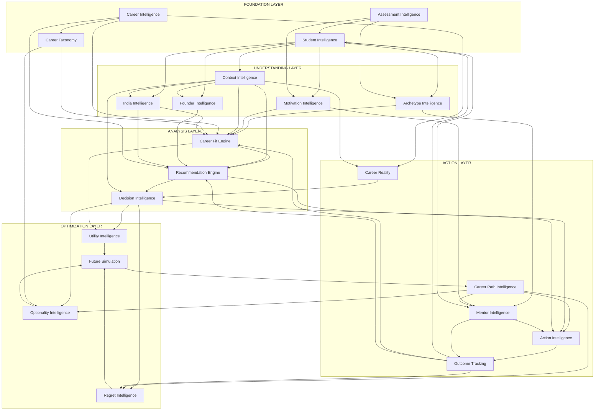

# 24 - Dependency Map

## Overview

This document maps all dependencies between intelligence modules in CareerOS. Understanding these dependencies is critical for:
- Planning development order
- Managing change impact
- Debugging issues
- Modular deployment

---

## Dependency Graph

---

## Module Dependencies

### 02 - Student Intelligence

**Dependencies:** None (Foundation)

**Consumed By:**
- Archetype Intelligence
- Motivation Intelligence
- Context Intelligence
- Founder Intelligence
- India Intelligence
- Career Fit Engine
- Mentor Intelligence
- Outcome Tracking

---

### 03 - Assessment Intelligence

**Dependencies:** None (Foundation)

**Consumed By:**
- Student Intelligence
- Archetype Intelligence
- Motivation Intelligence
- Career Fit Engine

---

### 04 - Archetype Intelligence

**Dependencies:**
- Student Intelligence (student profile, signals)
- Assessment Intelligence (trait scores, patterns)

**Consumed By:**
- Career Fit Engine (compatibility)
- Recommendation Engine (filtering)
- Mentor Intelligence (matching)

---

### 05 - Motivation Intelligence

**Dependencies:**
- Student Intelligence (preferences)
- Assessment Intelligence (motivation scores)
- Archetype Intelligence (context)
- Context Intelligence (situational factors)

**Consumed By:**
- Career Fit Engine (alignment)
- Recommendation Engine (prioritization)
- Decision Intelligence (explanations)
- Mentor Intelligence (matching)

---

### 06 - Context Intelligence

**Dependencies:**
- Student Intelligence (educational, demographic)
- India Intelligence (India-specific factors)
- Founder Intelligence (founder constraints)

**Consumed By:**
- Career Fit Engine (feasibility)
- Recommendation Engine (filtering)
- Decision Intelligence (awareness)
- Utility Intelligence (risk tolerance)
- Career Reality (reality validation)
- Career Path Intelligence (constraints)

---

### 07 - Founder Intelligence

**Dependencies:**
- Assessment Intelligence (founder traits)
- Context Intelligence (founder constraints)
- India Intelligence (India startup ecosystem)
- Career Intelligence (alternative comparison)

**Consumed By:**
- Recommendation Engine (entrepreneurship options)
- Career Fit Engine (founder fit)
- Career Path Intelligence (founder paths)
- Context Intelligence (context integration)

---

### 08 - India Intelligence

**Dependencies:**
- Student Intelligence (location, education)
- Context Intelligence (general context)
- External Data (market data)

**Consumed By:**
- Career Fit Engine (adjustments)
- Recommendation Engine (filtering)
- Career Reality (market validation)
- Founder Intelligence (ecosystem data)
- Context Intelligence (context enrichment)
- Career Path Intelligence (India-specific paths)

---

### 09 - Career Intelligence

**Dependencies:**
- Career Taxonomy (classification system)
- External Data (market data)
- Outcome Tracking (validation data)

**Consumed By:**
- Career Fit Engine (requirements)
- Recommendation Engine (universe)
- Career Path Intelligence (trajectories)
- Decision Intelligence (market data)
- Future Simulation (projections)
- Career Reality (reality data)
- Career Taxonomy (data for classification)

---

### 10 - Career Taxonomy

**Dependencies:**
- Career Intelligence (career data)
- External Taxonomies (skill, industry standards)
- Expert Input (validation)

**Consumed By:**
- Career Intelligence (classification)
- Career Fit Engine (skill matching)
- Recommendation Engine (similarity)
- Career Path Intelligence (transitions)
- Optionality Intelligence (transferability)

---

### 11 - Career Fit Engine

**Dependencies:**
- Student Intelligence (profile)
- Archetype Intelligence (archetype)
- Motivation Intelligence (motivators)
- Context Intelligence (constraints)
- Career Intelligence (requirements)
- Career Taxonomy (skills)
- India Intelligence (India adjustments)
- Assessment Intelligence (skill scores)

**Consumed By:**
- Recommendation Engine (ranking)
- Decision Intelligence (fit explanations)
- Action Intelligence (gap actions)
- Utility Intelligence (fit utility)
- Outcome Tracking (validation)

---

### 12 - Recommendation Engine

**Dependencies:**
- Career Fit Engine (fit scores)
- Student Intelligence (profile, history)
- Career Intelligence (universe)
- Context Intelligence (filtering)
- India Intelligence (India filtering)
- Founder Intelligence (founder options)
- Career Taxonomy (diversity)

**Consumed By:**
- Decision Intelligence (options)
- Action Intelligence (next steps)
- Student UI (display)
- Outcome Tracking (quality)

---

### 13 - Decision Intelligence

**Dependencies:**
- Recommendation Engine (options)
- Career Fit Engine (fit data)
- Career Intelligence (attributes)
- Context Intelligence (constraints)
- Utility Intelligence (value)
- Career Reality (reality checks)

**Consumed By:**
- Utility Intelligence (decision context)
- Optionality Intelligence (option analysis)
- Regret Intelligence (regret analysis)
- Action Intelligence (post-decision)
- Outcome Tracking (decision recording)

---

### 14 - Utility Intelligence

**Dependencies:**
- Student Intelligence (preferences)
- Career Intelligence (attributes)
- Career Fit Engine (fit scores)
- Motivation Intelligence (motivation value)
- Decision Intelligence (decision context)

**Consumed By:**
- Decision Intelligence (utility comparisons)
- Future Simulation (expected utility)
- Recommendation Engine (utility ranking)

---

### 15 - Optionality Intelligence

**Dependencies:**
- Career Path Intelligence (paths)
- Career Taxonomy (transferability)
- Career Intelligence (attributes)
- Decision Intelligence (decision context)
- Future Simulation (option evolution)

**Consumed By:**
- Decision Intelligence (optionality weighting)
- Future Simulation (option modeling)
- Recommendation Engine (strategic positions)

---

### 16 - Regret Intelligence

**Dependencies:**
- Decision Intelligence (decisions)
- Outcome Tracking (historical regret)
- Future Simulation (counterfactuals)
- Career Path Intelligence (paths not taken)

**Consumed By:**
- Decision Intelligence (regret minimization)
- Action Intelligence (regret-reducing actions)
- Outcome Tracking (regret validation)

---

### 17 - Future Simulation

**Dependencies:**
- Career Path Intelligence (paths)
- Student Intelligence (current state)
- Decision Intelligence (decisions)
- Career Intelligence (projections)
- Utility Intelligence (utility functions)
- Optionality Intelligence (option evolution)
- Regret Intelligence (scenarios)

**Consumed By:**
- Decision Intelligence (future comparison)
- Career Path Intelligence (path optimization)
- Regret Intelligence (regret scenarios)

---

### 18 - Career Path Intelligence

**Dependencies:**
- Career Intelligence (requirements, trajectories)
- Career Fit Engine (gaps)
- Career Taxonomy (transitions)
- Student Intelligence (current state)
- Context Intelligence (constraints)
- India Intelligence (India paths)
- Future Simulation (outcome modeling)

**Consumed By:**
- Action Intelligence (path decomposition)
- Mentor Intelligence (mentor matching)
- Optionality Intelligence (path flexibility)
- Regret Intelligence (path options)
- Future Simulation (path scenarios)

---

### 19 - Action Intelligence

**Dependencies:**
- Career Path Intelligence (paths)
- Recommendation Engine (recommendations)
- Career Fit Engine (gaps)
- Context Intelligence (constraints)
- Decision Intelligence (decisions)
- Mentor Intelligence (mentor actions)

**Consumed By:**
- Outcome Tracking (completion)
- Student UI (display)
- Notification System (reminders)

---

### 20 - Outcome Tracking

**Dependencies:**
- Action Intelligence (action completions)
- Decision Intelligence (decisions)
- Student Intelligence (student identification)
- Survey System (feedback collection)

**Consumed By (Feedback Loops):**
- Student Intelligence (progress updates)
- Career Fit Engine (fit validation)
- Recommendation Engine (quality)
- Regret Intelligence (actual regret)
- Career Intelligence (validation)

---

### 21 - Career Reality

**Dependencies:**
- Career Intelligence (market data)
- Context Intelligence (context)
- Outcome Tracking (actual outcomes)
- Mentor Intelligence (professional insights)
- Assessment Intelligence (perceptions)

**Consumed By:**
- Decision Intelligence (reality-informed)
- Student UI (reality display)
- Recommendation Engine (warning flags)

---

### 22 - Mentor Intelligence

**Dependencies:**
- Student Intelligence (profile)
- Archetype Intelligence (compatibility)
- Motivation Intelligence (matching)
- Career Path Intelligence (path matching)
- India Intelligence (mentor pool)

**Consumed By:**
- Action Intelligence (mentorship actions)
- Outcome Tracking (mentorship outcomes)
- Career Reality (professional perspectives)

---

## Dependency Matrix

| Module | Foundation | Understanding | Analysis | Optimization | Action |
|--------|------------|---------------|----------|--------------|--------|
| **Student Intelligence** | None | None | None | None | Outcome Tracking |
| **Assessment Intelligence** | None | None | None | None | None |
| **Archetype Intelligence** | SI, AI | None | None | None | None |
| **Motivation Intelligence** | SI, AI | AR | None | None | None |
| **Context Intelligence** | SI | FI, II | None | None | None |
| **Founder Intelligence** | AI | CO, II, CI | None | None | None |
| **India Intelligence** | SI | CO | None | None | None |
| **Career Intelligence** | CT, External | None | None | None | Outcome |
| **Career Taxonomy** | CI, External | None | None | None | None |
| **Career Fit Engine** | SI, AI | AR, MI, CO, II | CI, CT | None | None |
| **Recommendation Engine** | SI | CO, FI, II | CF, CI | None | None |
| **Decision Intelligence** | | | CF, RE, CI, CR | None | None |
| **Utility Intelligence** | SI | MI | CF | DI | None |
| **Optionality Intelligence** | | | | DI, CP, CT | None |
| **Regret Intelligence** | | | DI, CP | FS | None |
| **Future Simulation** | | | DI | UI, OI, RI | CP |
| **Career Path Intelligence** | | II | CI | FS | None |
| **Action Intelligence** | | | RE, DI | | CP |
| **Outcome Tracking** | SI | | | | AC |
| **Career Reality** | | | CI | | MI |
| **Mentor Intelligence** | SI | AR, MI | | | CP |

---

## Critical Path Dependencies

For the system to function end-to-end, the following modules must be operational:

### Minimum Viable Flow
1. **Student Intelligence** (identity)
2. **Assessment Intelligence** (signals)
3. **Career Intelligence** (universe)
4. **Career Fit Engine** (matching)
5. **Recommendation Engine** (output)

### Full Experience Flow
Add to minimum:
6. **Career Path Intelligence** (planning)
7. **Action Intelligence** (execution)
8. **Outcome Tracking** (feedback)

---

## Change Impact Analysis

| Module Changes Impact | Affected Downstream Modules |
|----------------------|----------------------------|
| Student Intelligence | All understanding, analysis, action modules |
| Assessment Intelligence | Archetype, Motivation, Career Fit |
| Career Intelligence | Career Fit, Recommendation, Path, Reality |
| Career Fit Engine | Recommendation, Decision, Utility, Outcome |
| Context Intelligence | Career Fit, Recommendation, Decision, Path |

---

*Last Updated: 2026-06-02*
