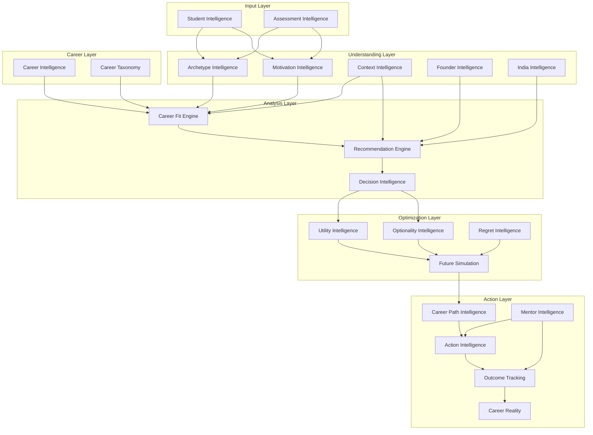

# CareerOS Intelligence Architecture

> **Single Source of Truth for CareerOS Intelligence Systems**

---

## Vision

To build the world's most sophisticated career intelligence platform that understands every student as a unique individual—with their own archetype, motivations, context, and potential—and guides them toward optimal career decisions through data-driven, personalized recommendations.

## Mission

Create an integrated intelligence ecosystem that:
- Captures the complete student profile through multi-dimensional assessments
- Maps the universe of career possibilities with deep contextual understanding
- Computes optimal career fits using multi-factor algorithms
- Simulates future scenarios to minimize regret and maximize optionality
- Translates insights into actionable career steps

## Core Philosophy

### Intelligence-First Design
Every feature begins with intelligence modeling. We understand the problem space before building solutions.

### Student-Centricity
The student is the center of gravity. All intelligence modules orbit around understanding and serving the individual student.

### Multi-Dimensional Understanding
Career decisions are complex. We capture signals across assessment, archetype, motivation, context, and market realities.

### Actionable Intelligence
Insights without action are worthless. Every intelligence module must feed into concrete next steps.

### Continuous Learning
The system improves with every student interaction, assessment completion, and outcome tracked.

---

## Intelligence Principles

| Principle | Description |
|-----------|-------------|
| **Composability** | Intelligence modules are designed to be composed, not monolithic |
| **Signal Integrity** | Each signal type is captured, validated, and weighted appropriately |
| **Context Preservation** | Student context (India-specific, founder journey, etc.) is maintained throughout |
| **Explainability** | All recommendations can be explained and audited |
| **Feedback Loops** | Outcomes feed back into model improvements |
| **Privacy by Design** | Student data is handled with strict privacy controls |

---

## System Map

---

## Module Map

| Module | Purpose | Status |
|--------|---------|--------|
| 01 System Overview | Architecture documentation | ✅ Complete |
| 02 Student Intelligence | Student profile management | 🚧 In Progress |
| 03 Assessment Intelligence | Assessment engine | 🚧 In Progress |
| 04 Archetype Intelligence | Student archetype classification | 🚧 In Progress |
| 05 Motivation Intelligence | Motivation analysis | 📋 Planned |
| 06 Context Intelligence | Contextual understanding | 📋 Planned |
| 07 Founder Intelligence | Founder journey support | 📋 Planned |
| 08 India Intelligence | India-specific context | 📋 Planned |
| 09 Career Intelligence | Career data management | 🚧 In Progress |
| 10 Career Taxonomy | Career classification | 🚧 In Progress |
| 11 Career Fit Engine | Fit calculation | 📋 Planned |
| 12 Recommendation Engine | Recommendation generation | 📋 Planned |
| 13 Decision Intelligence | Decision support | 📋 Planned |
| 14 Utility Intelligence | Utility calculation | 📋 Planned |
| 15 Optionality Intelligence | Optionality analysis | 📋 Planned |
| 16 Regret Intelligence | Regret minimization | 📋 Planned |
| 17 Future Simulation | Scenario simulation | 📋 Planned |
| 18 Career Path Intelligence | Path planning | 📋 Planned |
| 19 Action Intelligence | Action recommendations | 📋 Planned |
| 20 Outcome Tracking | Outcome monitoring | 📋 Planned |
| 21 Career Reality | Reality alignment | 📋 Planned |
| 22 Mentor Intelligence | Mentor matching | 📋 Planned |
| 23 Data Flow Map | Data flow documentation | ✅ Complete |
| 24 Dependency Map | Dependency documentation | ✅ Complete |
| 25 Roadmap | Implementation roadmap | ✅ Complete |
| 26 Audit History | Audit records | ✅ Complete |

---

## Implementation Progress

### Completed (3/26)
- ✅ Documentation Infrastructure
- ✅ Data Flow Mapping
- ✅ Dependency Mapping

### In Progress (5/26)
- 🚧 Student Intelligence
- 🚧 Assessment Intelligence
- 🚧 Archetype Intelligence
- 🚧 Career Intelligence
- 🚧 Career Taxonomy

### Planned (18/26)
- 📋 All remaining intelligence modules

---

## Current Status

**Phase**: Foundation & Documentation
**Focus**: Establishing intelligence architecture before implementation
**Next Milestone**: Complete core intelligence modules (Student, Assessment, Archetype)

---

## Future Roadmap

See [25-roadmap.md](./25-roadmap.md) for detailed roadmap.

### Phase 1: Foundation (Current)
- Documentation system
- Core data models
- Basic intelligence modules

### Phase 2: Core Intelligence
- Assessment engine
- Archetype classification
- Career taxonomy

### Phase 3: Analysis Engine
- Career fit calculation
- Recommendation generation
- Decision support

### Phase 4: Optimization
- Utility modeling
- Optionality analysis
- Future simulation

### Phase 5: Action & Outcomes
- Career path planning
- Action recommendations
- Outcome tracking

---

## Quick Navigation

| Document | Description |
|----------|-------------|
| [01-system-overview.md](./01-system-overview.md) | System architecture overview |
| [02-22] | Individual module documentation |
| [23-data-flow-map.md](./23-data-flow-map.md) | Complete data flow visualization |
| [24-dependency-map.md](./24-dependency-map.md) | Module dependency graph |
| [25-roadmap.md](./25-roadmap.md) | Implementation roadmap |
| [26-audit-history.md](./26-audit-history.md) | Audit records and findings |

---

## Contributing

When adding new intelligence modules:
1. Create module documentation following the standard template
2. Update this README module map
3. Update data flow and dependency maps
4. Add entry to roadmap
5. Record any architectural decisions in audit history

---

## Contact

For questions about the intelligence architecture:
- Architecture Lead: [TBD]
- Intelligence Team: [TBD]
- Documentation: This repository

---

*Last Updated: 2026-06-02*
*Version: 1.0.0*
